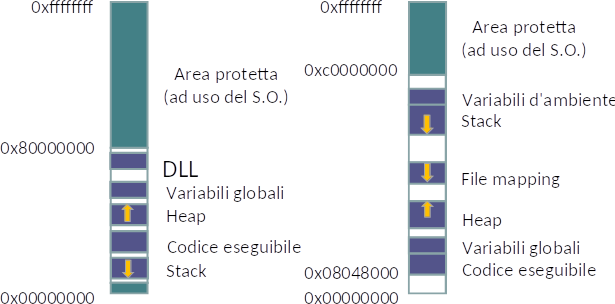
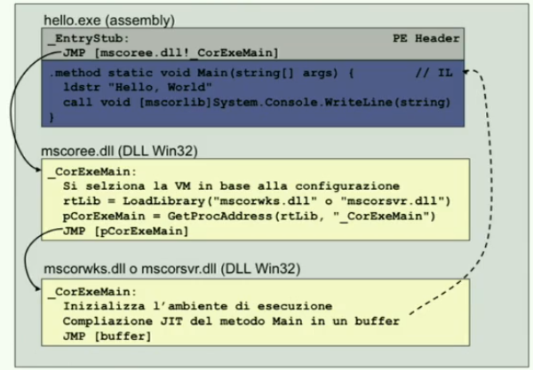

# System calls, programming, embedded systems, etc.
Course held by Prof. Malnati, summer 2018.

## Useful links
- [Exams](exams)
    - [Tips & tricks](exams/README.md)
- [Summary](summary/README.md)
- [Slides](slides)
- [O.S. books](http://www.os-book.com/)

Other courses notes on [marcomicera.github.io/mce](https://marcomicera.github.io/mce).

# Table of contents
1. [Piattaforme di esecuzione](#1-piattaforme-di-esecuzione)
    + [Interfacciarsi con il sistema operativo](#interfacciarsi-con-il-sistema-operativo)
    + [Convenzioni](#convenzioni)
    + [Gestione degli errori](#gestione-degli-errori)
      - [Windows](#windows)
      - [Linux](#linux)
    + [Gestione dei caratteri](#gestione-dei-caratteri)
      - [Windows](#windows)
        * [Single character](#single-character)
        * [Strings](#strings)
      - [Linux](#linux-1)
    + [POSIX](#posix)
2. [Il modello di esecuzione](#2-il-modello-di-esecuzione)
      - [Innalzamento di privilegio](#innalzamento-di-privilegio)
      - [Creazione di un processo](#creazione-di-un-processo)
        * [GCC/Linux start function](#gcclinux-start-function)
        * [Windows start function](#windows-start-function)
      - [Compiling with `-nostdlib`](#compiling-with--nostdlib)
3. [Allocazione della memoria](#3-allocazione-della-memoria)
    + [MMU flags](#mmu-flags)
        * [Accesso a locazioni non mappate](#accesso-a-locazioni-non-mappate)
    + [Tipi di variabili](#tipi-di-variabili)
    + [Spazio di indirizzamento](#spazio-di-indirizzamento)
    + [Allocazione statica e dinamica](#allocazione-statica-e-dinamica)
    + [Puntatori e il loro utilizzo](#puntatori-e-il-loro-utilizzo)
    + [Allocazione in Linux](#allocazione-in-linux)
    + [Allocazione in Windows (multiple heaps)](#allocazione-in-windows-multiple-heaps)
4. [Introduzione al C++](#4-introduzione-al-c)
    + [C++ compiler](#c-compiler)    
5. [Gestione delle eccezioni](#5-gestione-delle-eccezioni)
6. [Composizione di oggetti](#6-composizione-di-oggetti)
    + [Costruttore di copia](#costruttore-di-copia)
    + [Operatore di assegnazione](#operatore-di-assegnazione)
    + [La regola dei tre](#la-regola-dei-tre)
    + [Movimento](#movimento)
        * [Costruttore di movimento](#costruttore-di-movimento)
        * [Assegnazione per movimento](#assegnazione-per-movimento)
    + [Confronto signatures](#confronto-signatures)
    + [Paradigma *Copy&Swap*](#paradigma-copyswap)
      - [Why does it work?](#why-does-it-work)
    + [`std::move()`](#stdmove)
7. [Ereditarietà e polimorfismo](#7-ereditarietà-e-polimorfismo)
    + [Simple example](#simple-example)
      - [Ereditarieta' multipla](#ereditarieta-multipla)
    + [Polimorfismo](#polimorfismo)
      - [V-Table](#v-table)
    + [Type casting](#type-casting)
        * [Example for this chapter](#example-for-this-chapter)
      - [`static_cast<T>`](#static_castt)
      - [`dynamic_cast<T>`](#dynamic_castt)
      - [`reinterpret_cast<T>`](#reinterpret_castt)
      - [`const_cast<T>`](#const_castt)
8. [Funzioni e operatori](#8-funzioni-e-operatori)
    + [Puntatori a funzione](#puntatori-a-funzione)
    + [Oggetti funzionali o *funtori*](#oggetti-funzionali-o-funtori)
    + [Lambda functions](#lambda-functions)
    + [Operator overloading](#operator-overloading)
9. [Programmazione generica](#9-programmazione-generica)
    + [Generic functions](#generic-functions)
    + [Generic classes (templates)](#generic-classes-templates)
    + [Specializzare un template](#specializzare-un-template)
    + [Drawbacks](#drawbacks)
    + [Smart Pointer template](#smart-pointer-template)
      - [Different strategies](#different-strategies)
      - [C++ Smart Pointers](#c-smart-pointers)
10. [Librerie C++](#10-librerie-c)
      - [I/O](#i-o)
      - [Standard Template Library](#standard-template-library)
    + [Il processo di compilazione](#il-processo-di-compilazione)
11. [Librerie](#11-librerie)
    + [Tassonomia delle librerie](#tassonomia-delle-librerie)
        - [Librerie statiche](#librerie-statiche)
        - [Librerie dinamiche](#librerie-dinamiche)
12. [Programmazione concorrente](#12-programmazione-concorrente)
    + [Thread e memoria](#thread-e-memoria)
    + [Sincronizzazione in Windows](#sincronizzazione-in-windows)
    + [Sincronizzazione in Linux](#sincronizzazione-in-linux)
13. [Programmazione concorrente in C++](#13-programmazione-concorrente-in-c)
    + [Esecuzione asincrona](#esecuzione-asincrona)
    + [`std::mutex`](#stdmutex)
    + [`std::atomic<T>`](#stdatomict)
14. [Threads](#14-threads)
    + [Creazione di thread secondari](#creazione-di-thread-secondari)
    + [Restituzione dei risultati](#restituzione-dei-risultati)
      - [Cosa succede quando un thread fallisce](#cosa-succede-quando-un-thread-fallisce)
      - [Come terminare un thread](#come-terminare-un-thread)
      - [Thread lifecycle in RAII](#thread-lifecycle-in-raii)
      - [Retrieve results while secondary thread is still running](#retrieve-results-while-secondary-thread-is-still-running)
    + [Accedere al thread corrente](#accedere-al-thread-corrente)
15. [Condition variables](#15-condition-variables)
    + [Intro](#intro)
    + [Info](#info)
    + [Esempio](#esempio)
    + [Cosa serve per il problema produttore/consumatore](#cosa-serve-per-il-problema-produttoreconsumatore)
    + [Lazy evaluation: the Singleton pattern](#lazy-evaluation-the-singleton-pattern)
16. [Interprocess communication on Windows](#16-interprocess-communication-on-windows)
    + [Processi in Windows](#processi-in-windows)
    + [Processi in Linux](#processi-in-linux)
      - [`fork()` e threads](#-fork-e-threads)
    + [IPC: InterProcess Communication](#ipc--interprocess-communication)
    + [Sincronizzazione con oggetti kernel Windows](#sincronizzazione-con-oggetti-kernel-windows)
      - [Esempio di shared memory in Windows](#esempio-di-shared-memory-in-windows)
      - [Mailslot](#mailslot)
      - [Pipe](#pipe)
      - [File Mapping](#file-mapping)
      - [Altri meccanismi](#altri-meccanismi)
17. [Interprocess communication on Linux](#17-interprocess-communication-on-linux)
      - [Identificativi](#identificativi)
      - [Message Queues](#message-queues)
      - [Pipe](#pipe-1)
      - [FIFO](#fifo)
      - [Shared Memory](#shared-memory)
18. [C# introduction](#18-c-introduction)
    + [Properties](#properties)
    + [Achitettura .NET](#achitettura-net)
    + [Hello world](#hello-world)
      - [Compilation](#compilation)
      - [Struttura di esecuzione](#struttura-di-esecuzione)
    + [Disassembler example](#disassembler-example)
    + [NGEN: Native image GENeration](#ngen-native-image-generation)
    + [Sintassi](#sintassi)
      - [Cosa memorizza il Garbage Collector per ogni variabile](#cosa-memorizza-il-garbage-collector-per-ogni-variabile)
    + [Classi](#classi)
    + [Interfacce](#interfacce)
    + [Callback e `delegate`](#callback-e-delegate)
    + [Eventi](#eventi)
    + [Lambda function](#lambda-function)
    + [Attributes](#attributes)
19. [WPF](#19-wpf)
    + [Visual rendering](#visual-rendering)
    + [WPF development](#wpf-development)
    + [WPF threads](#wpf-threads)
      - [Dispatcher](#dispatcher)
    + [DependencyProperty](#dependencyproperty)
20. [Multithreading in .NET e C#](#20-multithreading-in-net-e-c)
    + [Classe `Thread`](#classe-thread)
      - [Thread exceptions](#thread-exceptions)
    + [Thread e applicazioni grafiche](#thread-e-applicazioni-grafiche)
    + [Sincronizzazione in .NET](#sincronizzazione-in-net)
      - [Monitor .NET](#monitor-net)

# 1. Piattaforme di esecuzione

### Interfacciarsi con il sistema operativo
- **API** (system calls)
    - Riguardano il codice sorgente
    - Completamente indipendenti dalla macchina fisica
- **ABI**: Application Binary Interface
    - Definisce che formato l'oggetto compilato deve assumere affinché sia eseguibile sulla macchina fisica
    - Dipendono dalla macchina fisica (x86, arm, etc.)
    - Esempi
        - Convenzioni di chiamata e passaggio dei parametri
        - Uso dei registri della CPU
        - Innalzamento di privilegio e invocazione del O.S.
    - Supportata dalla **toolchain**
        - Compiler (da codice sorgente `.c` a macchina `.o`)
        - Linker ()
        - Debugger
        - Profiler
        - Inspector

### Convenzioni
- Strutture dati che descrivono lo stato del sistema
- Accessibili tramite le API attraverso riferimenti opachi
    - `HANDLE` in Windows
    - File descriptors in Linux

### Gestione degli errori

#### Windows
- `BOOL`: `typedef` of `int`
- `HANDLE`: `typedef` of `void*`, `< 0` means failure
- `PVOID`: `typedef` of `void*`, `NULL` means failure
    - `malloc()` returns a `PVOID` because it doesn't know the content type
- `LONG`/`DWORD` (unsigned 32 bit): `typedef` of `unsigned long`
    - `GetLastError()`
        - VisualStudio's `ErrorLookup` for its meaning or `FormatMessage()`

#### Linux
- `errno`

### Gestione dei caratteri

#### Windows
##### Single character
`#ifdef UNICODE` switches between:
- `char`: 8 bit ASCII
- `wchar_t`: Unicode `UTF-16`

`TCHAR` is generic.
```c
BOOL CreateDirectoryA(LPCSTR lpPathName, ...);
BOOL CreateDirectoryW(LPCWSTR lpPathName, ...);

#ifdef UNICODE
#define CreateDirectory CreateDirectoryW 
#else
#define CreateDirectory CreateDirectoryA
#endif // !UNICODE
```
##### Strings
- `LPSTR`: `char` sequence with final `\0`
- `LPWSTR`: `wchar_t` sequence
- `LPTSTR`: `TCHAR` sequence (generic)

#### Linux
Non-ASCII as `UTF-8`

### POSIX
*Portable Operating System Interface*, low-level API standard and set of shell commands.
macOS is fully POSIX compliant, while Linux, Windows, and Android only partially.

# 2. Il modello di esecuzione

#### Innalzamento di privilegio
- Softare interrupt (trap)
- `SYSENTER`/`SYSEXIT`, on modern processors

#### Creazione di un processo
1. Creazione dello [**spazio di indizzamento**](#spazio-di-indirizzamento)
    - Insieme di locazioni di memoria accessibili tramite indirizzo virtuale
    - La MMU traduce da virtuale a fisico (e lancia page faults)
    - Nuova entry nella `GDT` (Global Descriptor Table)
    - **File eseguibile**: code, data, stack and heap
        - Formato ELF su Linux e PE2 su Windows
        - Caricato dal loader
    - All'inizio è vuoto, e ci saranno page faults
1. Caricamento dell'eseguibile in memoria
1. Caricamento delle librerie
    - DLLs (la shared già presenti non vengono ricaricate)
1. Avvio dell'esecuzione
    1. Inizializzazione:
        - Stack
        - Registri
        - Exception data structures
    1. Costruttori degli oggetti globali
    1. `main(int argc, char** argv)`
    1. `exit()`, che rilascia:
        - Spazio di indirizzamento
        - Tutte le risorse allocate

##### GCC/Linux start function
```c
int __libc_start_main(
    int (*main)(int, char**, char**), // code
    int argc,
    char** ubp_av,
    void (*init)(void), // inizializza variabili globali
    void (*fini)(void), // distrugge variabili globali in ordine inverso
    void (*rtld_fini)(void), // 'run-time loader finish', il loader de-mappa
    void* stack_end // quanto stack ha a disposizione
    // verra' eseguita una exit() alla fine
);
```

##### Windows start function
Funziona allo stesso modo. Ne esistono 4:

|              | Unicode | Mode    |
|--------------|---------|---------|
| `main()`     | no      | console |
| `wmain()`    | yes     | console |
| `WinMain()`  | no      | GUI     |
| `wWinMain()` | yes     | GUI     |

#### Compiling with `-nostdlib`
Take a look at the [example](nostdlib-example) ([guide](https://blogs.oracle.com/linux/hello-from-a-libc-free-world-part-1-v2)).

# 3. Allocazione della memoria

##### MMU flags
La MMU ha, per ogni pagina, un bit di:
- Read
- Write
- Execute (fetchable)
- [COW](https://en.wikipedia.org/wiki/Copy-on-write), copy-on-write, a.k.a. implicit sharing
    - When a resource is shared and the CPU wants to modify it, it has to copy it first
    - The copy operation is hence deferred to the first write. It's done with an interrupt
    - Utilizzato dalla `fork()` quando viene creato lo spazio di indirizzamento del child process

##### Tipi di variabili 
- Globali
    - Lifecycle: prima dell'esecuzione del programma
    - **Indirizzo fisso e assoluto** determinato dal compilatore e linker
        - Perche' devono essere sempre accessibili
    - Inizializzate o non
- Locali
    - Lifecycle: blocco
    - **Indirizzo relativo** all'inizio dello stack
        - Valore iniziale casuale
- Dinamiche (heap)
    - Lifecycle: da `malloc()` a `free()`
    - Ciclo di vita indipendente
    - Accessibili solo tramite puntatori
    - Inizializzate o non

### Spazio di indirizzamento

- Diverse aree per garantire diversi tipi di accesso (R/W/X)
- Accesso a locazioni non mappate
    - _Segmentation fault_ on Linux
    - _Access violation_ on Windows
- Aree
    - OS kernel space
    - Variabili d'ambiente
    - Codice eseguibile (R/X)
    - Stack (R/W)
        - Variabili locali
        - Valori di ritorno
        - Parametri
    - Costanti (R)
    - Variabili globali (R/W)
    - Heap (variabili dinamiche)
- Lo starting point nello spazio virtuale e' random, cosi' da rendere la vita difficile ai virus

### Allocazione statica e dinamica
- Linux
    - `void* malloc(size_t s)`
    - `void* malloc(int n, size_t s)`, per `n` volte
    - `void* realloc(void* p, size_t s)`, estende/riduce `p` con la nuova dimensione `s`
- Windows
    - *Global heap* e *local heap*
- Diverse aree per garantire diversi tipi di accesso (R/W/X)
- Accesso a locazioni non mappate
    - _Segmentation fault_ on Linux
    - _Access violation_ on Windows
- Lo starting point nello spazio virtuale e' random, cosi' da rendere la vita difficile ai virus
- [Page file](https://www.howtogeek.com/126430/htg-explains-what-is-the-windows-page-file-and-should-you-disable-it/)
    - > When your RAM becomes full, Windows moves some of the data from your RAM back to your hard drive, placing it in the page file
    - > This file is a form of virtual memory
- C++
    - Costruttore `new`/`delete`, che inizializza sempre
    - `new[]`/`delete[]` per array
    - Rilasciare con la funzione sbagliata puo' corrompere le strutture dati degli allocatori, con conseguenze imprevedibili

### Puntatori e il loro utilizzo
- Appartenente ad altri oggetti
    ```c
    int a = 10;
    int* pA = &a;
    ```
- Allocato allo scopo
    ```c
    int* pB = new int(24);
    ```
- Valori invalidi
    - `0`
    - Macro `NULL`, ovvero `((void*)0)
    - C++11 keyword `nullptr`
- Aritmetica dei puntatori
    ```c
    char* ptr = "String";
    for (int i = 0; *(ptr + 1) != 0; ++i) { /* ... */ }
    ```
- Rischi
    - *Dangling pointer*: puntatore che fa riferimento ad un area di memoria non piu' valida
    - *Memory leakage*
    - *Wild pointer*: puntatore non inizializzato

### Allocazione in Linux
- `malloc()` effettua una syscall dell'O.S., i cui dettagli dipendono dall'implementazione
    - `malloc()` per dati > 128KB chiama la `mmap()` che crea un blocco separato in un segmento inutilizzato
- Ogni PCB (*Process Control Block*) contiene una `mm_struct` (*memory descriptor*), che contiene
    - `start_brk`/`brk`: inizio/fine heap
        - `int brk(void* end_data_segment);` sposta il puntatore di fine heap
        - `void* sbrk(intptr_t increment);` puo' incrementare lo heap
    - `start_stack`

### Allocazione in Windows (multiple heaps)
- `malloc()` usa il *global heap*
- *Local heaps* management
    - `HANDLE HeapCreate()`
    - `void* HeapAlloc(HANDLE heap, DWORD options, SIZE_T s )`
    - `BOOL HeapFree(Handle heap, DWORD options, void* ptr)`
    - `BOOL HeapDestroy(HANDLE heap)`
        - Le aree di memoria diventano inaccessibili

# 4. Introduzione al C++
- Gli `static` fields sono nella memoria globale
- Come evitare dangling pointers:
    ```cpp
    char* ptr = "String";
    // ...
    delete ptr;
    ptr = NULL; // <---
    ```
    - Array dinamici
        ```cpp
        ptr = new[count] Something();
        delete[] ptr;
        ptr = NULL;
        ```

### C++ compiler
- Gestisce il ciclo di vita delle variabili globali e locali

# 5. Gestione delle eccezioni
- `#include<std::exception>`
    - `what()` contiene il messaggio
    - `#include<stdexcept>`
        - `std::logic_error`
            - `domain_error`, `invalid_argument`, `length_error`, `out_of_range`, etc.
        - `std:runtime_error`
            - `overflow_error`, `range_error`, `underflow_error`, etc.
            - `#include<system_error>`, solo in C++11
                - `system_error` contiene `code()` che restituisce l'equivalente di `errno`
    - `#include<new>` per mancanza di memoria
    - `#include<ios>` I/O errors
    - `#include<future>` esecuzione asincrona, C++11
    - `#include<typeinfo>` cast dinamici o RTTI (*RunTime Type Identification*)
- `catch( ... )` cattura tutte le eccezioni
- `finally` non esiste
    - Lo stack viene contratto al lancio di un'eccezione
    - Tutti i distruttori interessati vengono chiamati
        - Paradigma **RAII**: *Resource Acquisistion Is Initialization*, cioe' chiudere la risorsa nel distruttore
        - I distruttori non dovrebbero lanciare eccezioni

# 6. Composizione di oggetti

### Costruttore di copia
```cpp
class CBuffer {
    int size;
    char* ptr;
public:
    CBuffer(const CBuffer& source) {
        this->size = source.size;
        this->ptr = new char[size];
        memcpy(this->ptr, source.ptr, size); 
    }
};
```
Per renderlo non copiabile, renderlo `private` e senza body.

### Operatore di assegnazione
Per oggetti gia' esistenti.
```cpp
CBuffer& operator=(const CBuffer& source) {
    
    // Altrimenti verrebbe eliminato l'oggetto corrente, e ci sarebbero errori durante la copia.
    if (this != &source) {
        
        // Distruzione dell'oggetto corrente per evitare un memory leakage
        delete[] this->ptr;
        this->ptr = NULL; // evita dangling pointer se `new char[size]` fallisce successivamente.
                          // `delete NULL;` e' lecito.
                          // In caso in cui `new char[size]` fallisca, il compiler rilascerebbe
                          // un'altra volta la memoria se `this->prt != NULL`
                          // (perche' fa roll-back, non si e' in un blocco try...).

        // Copia di tutti i fields, come nel costruttore di copia
        this->size = source.size;
        this->ptr = new char[size]; // puo' lanciare un eccezione se non c'e' memoria
        memcpy(this->ptr, source.ptr, size); 
    }
    
    return *this; // allows '= chains'
}
```
Per renderlo non assegnabile, renderlo `private` e senza body.

### La regola dei tre
Devono esistere tutte le tre seguenti funzioni, o nessuna:
- Costruttore di copia
- Operatore di assegnazione
- Distruttore

Altrimenti il compilatore fornira' la propria implementazione.

### Movimento
- "Svuotare" un oggetto che sta per essere distrutto del suo contenuto e "travasarlo" in un altro oggetto
- Candidati al movimento:
    - Variabili locali al termine del blocco in cui sono state definite
    - Risultati di espressioni temporanee
    - Oggetti anonimi costruiti a partire dal tipo per passarlo come parametro
        ```cpp
        function(std:string("ciao"));
        ```
    - **RVALUE**s (tutto cio' che non ha un nome e puo' comparire solo alla destra di `=`)
        - `int&&` e' un RVALUE
- **Il compiler sceglie** se usare il costruttore/assegnazione di movimento o di copia
    - Usa quello di movimento **se subito dopo viene chiamato il distruttore**
- I thread e `std::unique_ptr` non sono copiabili, ma solo movibili

##### Costruttore di movimento
```cpp
class CBuffer {
    int size;
    char* ptr;
public:
    // Il compilatore decide quando usarlo, preferendolo a quello di copia
    CBuffer(CBuffer&& source) { // '&&' = RValue reference
        this->size = source.size;
        this->ptr = source.ptr; // vantaggio
        source.ptr = NULL; // l'originale viene modificato!
    }
};
```
- Compiler's pseudocode:
    ```cpp
    Obj_MoveConstructor(dst, src);
    Obj_Destructor(src)
    ```
- Esempio:
    ```cpp
    string f() {
        string x("...");
        string a(x); // x e' un LVALUE, percio' viene copiato
        string b(a + x); // (a + x) e' un RVALUE, viene spostato
        string c(funzioneCheRitornaString()); // Risultato mosso in c
        return c; // c viene mosso nel risultato
    }
    ```
- Il costruttore di copia non porta a nessun vantaggio se la classe contiene tutti tipi primitivi
    - Per i tipi primitivi, il costo della copia e' uguale al costo del movimento

##### Assegnazione per movimento
```cpp
class CBuffer {
    int size;
    char* ptr;
public:
    CBuffer& operator=(CBuffer&& source) {
        if (this != &source) {
            delete[] this->ptr; // svuotamento dell'oggetto destinazione
            this->size = source.size;
            this->ptr = source.ptr;
            // source.size = 0; // inutile, `source` verra' distrutto 
            source.ptr = NULL; // la sua successiva distruzione non fara' danno
        }
        return *this;
    }
};
```

### Confronto signatures
- Costruttore di copia
    ```cpp
    CBuffer(const CBuffer& source)
    ```
- Operatore di assegnazione
    ```cpp
    CBuffer& operator=(const CBuffer& source)
    ```
- Costruttore di movimento
    ```cpp
    CBuffer(CBuffer&& source)
    ```
- Assegnazione per movimento
    ```cpp
    CBuffer& operator=(CBuffer&& source)
    ```

### Paradigma *Copy&Swap*
Per evitare errori dovuti alla dimenticanza di `this->prt = NULL;`
```cpp
class intArray {

    std::size_t mSize;
    int* mArray;

public:

    // Costruttore
    intArray(std::size_t size = 0): mSize(size), mArray(mSize ? new int[mSize] : NULL) {}

    // Costruttore di copia
    intArray(const intArray& that): mSize(that.mSize), mArray(mSize ? new int[mSize] : NULL) {
        std::copy(that.mArray, that.mArray + mSize, mArray);
    }

    // Distruttore
    ~intArray() { delete[] mArray; }

    // Funzione esterna ad una classe, ma che puo' accedere ai suoi `private` fields 
    friend void swap(intArray& a, intArray& b) {
        std::swap(a.mSize, b.mSize);
        std::swap(a.mArray, b.mArray);
    }

    // Operatore di assegnazione secondo il paradigma Copy&Swap
    intArray& operator=(intArray that) { // per valore, copiato o mosso a seconda
                                         // del contesto
        swap(*this, that); // usa la versione custom di questa classe
        return *this;
    }

    // Costruttore di movimento secondo il paradigma Copy&Swap
    intArray(intArray&& that): mSize(0), mArray(NULL) {
        swap(*this, that);
    }
};
```
#### [Why does it work?](https://stackoverflow.com/questions/3279543/what-is-the-copy-and-swap-idiom)
> We first notice an important choice: the parameter argument is taken by-value.\
> While one could just as easily do the following (and indeed, many naive implementations of the idiom do):
```cpp
intArray& operator=(const intArray& that) {
    dumb_array temp(that); // inefficient!
    swap(*this, temp);

    return *this;
}
```
1. Passing by value [is faster](https://web.archive.org/web/20140113221447/http://cpp-next.com/archive/2009/08/want-speed-pass-by-value/)
2. > If you're going to make a copy of something in a function, let the compiler do it in the parameter list
> Either way, this method of obtaining our resource is the key to eliminating code duplication: we get to use the code from the copy-constructor to make the copy, and never need to repeat any bit of it.

> Observe that upon entering the function that all the new data is already allocated, copied, and ready to be used. This is what gives us a strong exception guarantee for free: **we won't even enter the function if construction of the copy fails**, and it's therefore not possible to alter the state of `*this`.

> At this point we are home-free, because `swap` is non-throwing. We swap our current data (`this`) with the copied data (`that`), safely altering our state, and the old data gets put into the temporary. The old data is then released when the function returns. (Where upon the parameter's scope ends and its destructor is called.)

### `std::move()`
- Forza il passaggio per movimento
    - Fa uno static cast ad un RVALUE
- Esempio
    ```cpp
    std::string str("hello");
    std::vector<std::string> v;
    v.push_back(str);   // `str` e' copiato
                        // v = ["hello"], str = "hello"
    v.push_back(std::move(str));    // `str` e' spostato
                                    // v = ["hello", "hello"], str = ""
    ```

# 7. Ereditarietà e polimorfismo

### Simple example
```cpp
class File {
    int fileDescriptor;
public:
    uint_8 read();
    size_t readBlock(uint_8 *ptr, size_t offset, size_t count);
    int close();
}

class TextFile : public File {
    CharCodec codec;
public:
    wchar_t readChar();
    size_t readCharBlock(wchar_t *ptr, size_t offset, size_t count);
};
```
`TextFile` puo' chiamare `File::read()`.

#### Ereditarieta' multipla
- E' consentita
- Per questo non esiste la `super` keyword
    - La sub-class deve utilizzare lo scope-operator
        ```cpp
        class TextFile : public File {
            // ...
        public:
            TextFile(): File() { File::read(); }
        }
        ```

### Polimorfismo
- Example
    ```cpp
    File* f = new TextFile(); // ok
    TextFile* tf = new File(); // error
    ```
- Difference with Java:

    |   | Java | C++ |
    |---|---|---|
    | Polymorfic | - | `virtual` |
    | Non-overridable | `final` | - |
    
    - I metodi poliformici introducono un overhead
- Overridden methods:
    ```cpp
    class File {
    public:
        int m() { return 1; }
        virtual int mv() { return 1; } // solo le `virtual` sono polimorfiche
        virtual int ma() = 0; // classe non implementabile (polimorfico puro o virtuale astratto)
    }

    class TextFile : public File {
    public:
        int m() { return 2; }
        int mv() { return 2; }
    }

    int main(int argc, char** argv) {
        File* prt = new TextFile(); // se File::ma() non esistesse
        std::cout << ptr->m(); // 1 (2 in Java)
        std::cout << ptr->mv(); // 2
        // ...
    }
    ```
- Distruttori virtuali
    - Se una classe ha una funzione `virtual`, dovrebbe avere anche il distruttore `virtual`, altrimenti potrebbe essere chiamato un distruttore sbagliato

#### V-Table
Per far si' che il compiler distingua quale implementazione usare quando viene invocato un metodo poliformico (overridden), le classi con almeno un metodo `virtual` hanno un puntatore aggiuntivo che punta ad una **V-Table** che ha tante entry quanti sono i metodi `virtual` nella classe stessa.

- Le sue entries contengono gli indirizzi delle implementazioni concrete dei metodi polimorfici
- Costruita a compile-time
    - Statica
    - Condivisa da tutte le istanze concrete della stessa classe
- Ereditarieta'
    - Ereditarieta' semplice: una V-Table, prima le entry della super-class, poi quelle della classe stessa
    - Erediterieta' multipla: tante V-Table quante sono le super-classi piu' una per la classe stessa

### Type casting

##### Example for this section
```cpp
class Base1;
class Base2;
class Derivata : public Base1, public Base2 {};
//...
Derivata* d = new Derivata();
Base1* b1;
Base2* b2;
```

#### `static_cast<T>`
- Esempio
    ```cpp
    b1 = static_cast<Base1*>(d);
    b2 = static_cast<Base2*>(d);
    ```
- Done at compile time
    - No guarantee it actually makes sense
    - Efficient
- Viene cambiata il puntatore alla V-Table
    - Durante un downcast, la dimensione della V-Table diminuisce (il valore del puntatore aumenta)
- L'upcasting e' sempre garantito, il downcasting no
- Usato per conversioni lungo l'asse ereditario
- Il compiler deve avere delle regole di conversione tra i tipi.
    - Importatore:
        ```cpp
        /* not explicit */ Base1(Derivata d) { /* ... */ }
        ```y nella V-Table
        - `explicit` avverte il compiler di non utilizzare la funzione per effettuare `static_cast<T>`
    - Esportatore:
        ```cpp
        Base1 Derivata::operator_cast() { /* ... */ } // FIXME
        ```

#### `dynamic_cast<T>`
- RTTI: Run-Time Type Information
    - Ogni oggetto ha un hash per il compatibility check
- Downcasting sicuro, perche' se non e' possibile ritorna:
    - `0` su puntatore invalido
    - Runtime exception su riferimento incompatibile
- Esempio di downcasting
    ```cpp
    Base1* b1 = new Base1();
    Derivata* d = dynamic_cast<Derivata*>(b1); // d = NULL
    ```
    - `static_cast<Derivata*>(b1)` avrebbe eseguito, creando problemi

#### `reinterpret_cast<T>`
- Il cast del C
- Interpreta la sequenza di bit come un altro tipo
    - Nessun check
- Adatto al low level programming
    - Chiamate dall'O.S.
    - Byte ricevuti da altro hardware

#### `const_cast<T>`
- Rimuove il descrittore `const` da una variabile

# 8. Funzioni e operatori

### Puntatori a funzione
- Syntax
    ```cpp
    <return_value> (*name) (<arguments>)
    ```
- Example
    ```cpp
    int f(int i, double d) { /* ... */ }
    int (*var)(int, double);
    var = f;
    var = &f; // it's the same, more coherent
    var(10, 3.14); // calls f()
    ```
    - Default arguments
        ```cpp
        int g(int, int = 4);
        int (*p)(int) = &g; // ERROR: missing 2nd default argument
        ```

### Oggetti funzionali o *funtori*
- Example
    ```cpp
    class FC {
    public:
        int operator()(int v) {
            return v*2;
        }
    };

    FC fc;
    int i = fc(5);  // object behaving like a function
                    // i = 10
    ```
- Usage
    - Non-deterministic functions (they have access to `this`)
    - Example
        ```cpp
        class Accumulator {
            int tot;
        public:
            Accumulator():tot(0) {}
            int operator()(int v) {
                tot += v;
                return v;
            }
            int tot() { return tot; }
        };

        void main () {
            Accumulator a;
            for (int i = 0; i < 10; i++)
                a(i);
            std::cout << "Total: " << a.tot() << std::endl; // 45
        }
        ```
- Oggetti funzionali e puntatori a funzione
    ```cpp
    template <typename F>
    void some_function(F& f) {
        f(); // puntatore a funzione o oggetto funzionale
    }
    ```

### Lambda functions
- [Syntax](https://en.cppreference.com/w/cpp/language/lambda)
    ```
    [ captures ] ( params ) [ mutable ] [ exception ] [-> ret] { body }
    ```
    - `mutable`
        > Allows `body` to modify the `params` captured by copy, and to call their non-const member functions
- Usato nella libreria standard: lambda function
    ```cpp
    int main() {
        std::vector<int> v;
        // ...
        std::for_each(v.begin(), v.end(), 
            [](int i) { std::cout << i << " "; }
        );
    }
    ```
    - Il tipo di ritorno non sempre e' omettibile
        ```cpp
        [](int num, int den) -> double {
            if (den == 0)
                return std::NaN;
            else
                return (double)num/den;
        }
        ```
- Captured vars
    - Variabili locali il cui valore o riferimento si vuole rendere disponibili nella funzione
    - Le context variables devono essere dichiarate nell'outer block in cui la lamba function e' definita
    - `[x, y]` per valore
    - `[&x, &y]` per riferimento
    - `[&]` cattura tutto per riferimento
- Usage
    - Algoritmi generici
    - Programmazione funzionale: programmazione in cui funzioni ritornano altre funzioni
    - Programmazione concorrente

### Operator overloading
- Non si possono definire nuovi operatori
- Non si possono cambiare le precedenze

# 9. Programmazione generica
- In Java, a runtime e' tutto `Object`, ma il down-casting tempo durante l'esecuzione
    - A runtime e' possibile non rispettare i vincoli
        ```java
        MyList<Integer> myList = new MyList<>(); // `MyList<Object>`
        myList.append("String"); // OK
        ```
- In C++, i templates sono **compilati** in due fasi:
    1. Coerenza ai vincoli
    2. Istanziazione dei template: generazione del codice a seconda degli utilizzi
        - I templates quindi **sono completamente risolti in fase di compilazione**
- Applicabile a **funzioni o a classi**

### Generic functions
- Example
    ```cpp
    template <class T>
    const T& max(const T& t1, const T& t2) {
        return (t1 < t2 ? t2 : t1);
    }
    ```
    - `T` deve avere `operator+()`
    - `T` deve aver un costruttore di copia, per derivare una variabile temporanea a partire da un dato costante
    - Forzare la scelta
        ```cpp
        max<double>(2, 3.14);
        ```

### Generic classes
- Example
    ```cpp
    template <class T>
    class Accum {
        T total;
    public:
        Accum(T start): total(start) {}
        T operator+(const T& t) { // T must override operator+()
            return total = total + t;
        }
        T value() {
            return total; // T must have a copy constructor, ritorno per copia
        }
    };

    Accum<std::string> sa("");
    Accum<int> ia(0);
    ```
- Anche con valori fissati
    ```cpp
    template <class T, int size> // valore costante, non una espressione
    ```

### Specializzare un template
- Alcuni tipi potrebbero essere non utilizzabili all'interno di un template
    - Potrebbero non avere l'implementazione di un operatore usato nella definizione del template stesso.\
    E.g., se nella definizione del template, due oggetti generici si sommano, il tipo dovra' implementare `operator+()`.
- Alternative:
    - Cambiare il template: raro, dati dalle librerie
    - Modificare la classe
    - Specializzare il template
        - Example
            ```cpp
            class Person { // incapsula una stringa
                std::string name;
            public:
                Person(std::string n): name(n) {}
                // Does not override operator+().
                // How could we use the `Accum`(ulator) template
                // with `Person`(s)?
            };

            // Template specializzato per la classe `Person`
            template<> class Accum<Person> {
                int total;
            public:
                Accum(int start = 0): total(start) {}
                int operator+(const Person&) { return ++total; }
            };
            ```

### Drawbacks
- Vanno verificate le assunzioni sui tipi effettivamente usati
    - Esempio: templates della standard library assumono che l'oggetto sia:
        1. Copiabile (costruttore di copia)
        1. Assegnabile (operatore di assegnazione)
    - Altrimenti: compile error
        - Error message non preciso, perche' C++ prova prima ad effettuare conversioni

### Smart Pointer template
- Overload degli operatori classici: `*` e `->`
    - `!` per la validita': `while(!ptr)`
    - Esempio stupido
        ```cpp
        class int_ptr {
            int* ptr;
            int_ptr(const int_ptr&); // no copy constructor
            int_ptr& operator=(const int_ptr&); // no assignment
        public:
            explicit int_ptr(int* p): ptr(p) {}
            ~int_ptr() { delete ptr; }  // Assunzione, il `p` sovrastante
                                        // deve essere allocato sullo heap,
                                        // altrimenti questo non ha senso.
            int& operator*() { return *ptr; } // Errore se `p` fosse NULL
        };

        int i = 1;
        int_ptr ip(&i); // il distruttore chiamera' `delete` su un elemento
                        // dello stack => errore
        ```
- Vantaggi sui puntatori classici:
    - Garanzia di inizializzazione (costruttore) e rilascio (distruttore)
    - Conteggio dei riferimenti
    - Accesso controllato
- Generic smart pointer
    ```cpp
    template <class T>
    class smart_ptr {
        T* ptr;
        smart_ptr(const smart_ptr<T>&);
        smart_ptr<t>& operator=(const smart_ptr<T>&);
    public:
        explicit smart_ptr(T* p = 0): ptr(p) {}
        ~smart_ptr() { delete ptr; }
        T& operator*() { return *ptr; }
        T* operator->() { return ptr; }
    };

    void example() {
        smart_ptr<MyClass> p(new MyClass());    // RAII: il ciclo di vita della
                                                // risorsa (il pointer) coincide
                                                // con quello dell'oggetto che
                                                // lo racchiude.
        
        p->execute();   // destructor deletes pointer in case of exception
                        // (stack unwinding)

        // no `delete` on pointer
    }
    ```

#### Different strategies
- Passaggio di proprieta'
- Creazione di una copia
- Condivisione con conteggio dei riferimenti
    - Garbage collector, with all its drawbacks (no cycles, overhead, etc.)
- Condivisione in lettura (`const`) e duplicazione in scrittura

#### C++ Smart Pointers
```cpp
#include <memory>
```
- `std::shared_ptr<BaseType>`
    - Conteggio dei riferimenti
    - Copiabile e assegnabile
    - Inizializzabile 
        - `make_shared<BaseType>(params...)`
        - Copia o assegnazione
    - `NullPointerException` se inizializzato con `NULL`
    - Due campi: 64 bit, accesso due volte
        - 
        - Proprieta' condivisa `objectPtr`
        - Blocco di controllo `counterPtr`
            - `counter`, contatore dei riferimenti
            - `weakCnt`
            - `objectPtr`, per distruttore
    - Non supporta dipendenze cicliche
    - E' possibile specificare un distruttore (altrimenti usa `delete`)
    - `get()` restituisce una copia del puntatore nativo
        - Per backward-compatibility
    - `reset()` decrementa il contatore ed elimina il riferimento
- `std::weak_ptr<BaseType>`
    - Senza conteggio di riferimenti = cicli
    - Si crea a partire da uno `shared_ptr`
    - Si accede al dato promuovendolo temporaneamente ad uno `shared_ptr` tramite `lock()`
        - Controllare la validita' con `expired()`
    - Puntano solo al blocco di controllo
        - Non partecipano al conteggio dei riferimenti
    - Esempio
        ```cpp
        std::weak_ptr<int> gw;
        
        void f() {
            if (auto spt = gw.lock())
                std::cout << "gw: " << *spt << "\n";
            else
                std::cout << "gw e' scaduto\n";
        }
        
        int main() {
            {
                auto sp = std::make_shared<int>(42);
                gw = sp;
                f(); // OK
            
            } // sp viene distrutto, gw scade

            f(); // scaduto
        }
        ```
- `std::unique_ptr<BaseType>`
    - Non copiabile, ne' assegnabile
        - Nessuna struttura di controllo dei conteggi
    - Movibile per
        - Costruzione
        - Operatori di movimento
            - Trasferito ad un altro `unique_ptr`
            - Esplicitamente con `std::move()`
    - Usi
        - Garantire la distruzione di un oggetto
        - Gestione sicura di oggetti polimorfici
        - `std::make_unique<BaseType>()`

# 10. Librerie C++

#### I/O
- `stdio.h` (`printf()`, `scanf()`, etc.) gestiscono solo i tipi elementari
- `ios` e' la classe base (virtuale) di tutti gli stream
    - Stato dello stream
    - Manipolazione del formato
- `std::cout`, `std::cin`, `std::cerr` e `std::clog` sono variabili
    - `if (!cout)` o `if (!cin.good())` per fare il check di errori, perche' non vengono lanciate eccezioni

#### Standard Template Library
- `std::set` richiede l'implementazione di `operator<()`
- Iterators
    - Gli iteratori sono sottoclassi dei containers (`vector`, `list`, etc.)
    - Esempio
        ```cpp
        class C;
        list<C> l(10);

        list<C>::iterator iter = l.begin();
        list<C>::iterator end = l.end();

        for (; iter != end; ++iter) {
            C elem = *iter;
            // ...
        }

        std::for_each(l.being(), l.end(), print);
        ```
- Le `map` usano `pair<t1, t2>`

### Il processo di compilazione
- [The `extern` keyword](https://docs.microsoft.com/en-us/cpp/cpp/extern-cpp?view=vs-2019)
    > The `extern` keyword is applied to a global variable, function or template declaration to specify that the name of that thing has external linkage

    > `extern "C"` specifies that the function is defined elsewhere and uses the C-language calling convention.\
    The `extern "C"` modifier may also be applied to multiple function declarations in a block.

# 11. Librerie
- L'uso di una libreria richiede due fasi
    1. Identificazione dei moduli necessari e loro caricamento in memoria
    1. Aggiornamento degli indirizzi per puntare correttamente ai moduli caricati
- Librerie gestite da:
    - Linker (librerie statiche)
    - Loader (librerie collegate dinamicamente)
    - Durante l'esecuzione dal programma stesso (librerie caricate dinamicamente)
- Il loader carica dei `.dll` in modo ricorsivo


### Tassonomia delle librerie
- Librerie statiche (linker)
- Librerie dinamiche
    - Collegate dinamicamente (loader)
    - Caricate dinamicamente (dal programma stesso)

#### Librerie statiche
- Stessi contenuti in processi differenti
    - Pagine fisiche replicate
- Ogni applicazione che fa uso di una libreria statica dev'essere ricompilata ad ogni modifica della libreria
- Archivio, `lib*.a` in Linux e `.lib` in Windows
    - Concatenazione di file `.o`
    - L'*archiver* `ar` aggiunge file `.o` ad una libreria statica
- Flag `-l` al compiler per specificare librerie
    - In Linux, `-lpthread` diventa `lib_pthread.a`
    - Vengono cercate nella current directory e in `LD_LIBRARY_PATH`
    - `gcc` usa `-lc`, `g++` usa `lcc
- Flag `-L` al compiler per specificare directory contenenti librerie

#### Librerie dinamiche
- L'executable contiene info su dove recuperare le librerie
- File `.so` in Linux (ELF) e `.dll` in Windows (PE2)
- Condivisione di pagine fisiche
    - Librerie mappate in spazi di indirizzamento lontani dall'executable
- Linux dynamic linker: `ld.so`
    - E' anch'esso una libreria dinamica
    - Non ha riferimenti a nessun'altra libreria
    - Viene sempre mappato in memoria
    - Mappato nello spazio virtale, ma vengono usate sempre le stesse pagine fisiche
- In Windows, il dynamic linker fa parte del kernel
- Come si caricano in Linux
    - `dlopen()` mappa un `.o` nello spazio di indirizzamento del programma
    - `dlsym()` cerca l'indirizzo di un simbolo (variable o funzione) di un file `.o` aperto
    - `dlerror()` per l'ultimo errore occorso
    - `dlclose()` unmappa una libreria `.so` dallo spazio di indirizzamento
    - Esempio
        ```c
        #include <stdio.h>
        #include <dlfcn.h>

        void invoke(char* lib, char* m, float arg) {
            void* dl_handle = dlopen(lib, RTLD_LAZY); // lazy loading
            if (!dl_handle) return;
            float (*func)(float) = dlsym(dl_handle, m); // cerca `cosf()`
            if (func==NULL) return;
            printf("Result: %f\n", (*func)(arg)); // chiama `cosf()` di 'libm.so'
            dlclose(dl_handle);
        }

        int main(int argc, char *argv[]){
            invoke("libm.so", "cosf", 3.14156f);
        }
        ```
- Come si caricano in Windows 
    - I DLL possono contenere anche risorse (pointers)
    - I DLL possono avere una funzione di ingresso `DllMain`
        - Il loader la invoca prima di ritornare il controllo al programma
        - La DLL puo' fare una inizializzazione globale
        - Parametri: `DllMain(HINSTANCE handle, DWORD r, PVOID unused)`
            - `HANDLE` della DLL
            - Flag
                - `DLL_PROCESS_ATTACH`: DLL mappata in un processo
                - `DLL_PROCESS_DETACH`: DLL about to be un-mapped
                - `DLL_THREAD_ATTACH` e `DLL_THREAD_DETACH` per Visual Basic
    - `LoadLibrary()` mappa un DLL nello spazio di indirizzamento del programma
        - `HANDLE` per l'indirizzo della DLL (`HMODULE`) o errore con `GetLastError()`
- Condivisione variabili
    - Le variabili globali di una stessa DLL non vengono condivise tra processi diversi
        - ELF e PE hanno segmenti di codice e dati, e questi ultimi non sono condivisi
    - E' possibile creare zone di memoria condivise tra tutti i processi che utilizzano una certa DLL
        - Solo per variabili inizializzate
        - Apposito segmento in DLL
    - [Esportazione simboli](https://stackoverflow.com/questions/10222566/what-is-dllspecdllimport-and-dllspecdllexport-means)
        - > `__dllspec(dllexport)` exports a symbol. It makes it available from outside a DLL. 
        - > `__declspec(dllimport)` imports a symbol. It practically says "this symbol is not defined in this application, it needs to be imported from a DLL file".
        - In header files `.h` appositi
        - [Esempio](https://stackoverflow.com/questions/37571359/c-cpp-calling-a-dll-dynamically-with-parameters)
            ```c
            // SampleDLL.h
            #ifdef EXPORTING_DLL    // il pre-compiler vede tutti i simboli di tutti
                                    // i moduli. Questa define deve avere un nome
                                    // particolare per evitare dei clash
            extern __declspec(dllexport) void HelloWorld();
            #else
            extern __declspec(dllimport) void HelloWorld();
            #endif
            ```

            ```c
            // SampleDLL.c
            #define EXPORTING_DLL
            #include "sampleDLL.h"

            BOOL APIENTRY DllMain(…)

            void HelloWorld() { printf("Hello world"); }
            ```

            ```c
            // Static_Dll_usage.c 
            #include "sampleDLL.h"
            void someMethod() {
                HelloWorld();
            }
            ```

            ```c
            // Dynamic_Dll_usage.c
            typedef VOID (*DLLPROC) (LPTSTR);

            // L"string" per widechar (UNICODE)
            HINSTANCE hDLL = LoadLibrary(L"sampleDLL.dll");

            if (hDLL != NULL) {
                DLLPROC Hw = (DLLPROC)GetProcAddress(hDLL, L"HelloWorld");
                if (Hw != NULL)
                    (*Hw)(); // "Hello world'
                FreeLibrary(hDLL);
            }
            ```
    - `extern c` per evitare il name mangling del compiler
        - Name mangling: il compilatore sporca il nome delle funzioni col fine di permetterne l'overloading
        ```cpp
        // SampleDLL.def
        LIBRARY "sampleDLL"

        EXPORTS
            HelloWorld
        ```
    - Vecchia soluzione: file module definition `.def` con la lista di simboli da importare ed esportare
- Compilazione DLL: i file `.lib`
    - Visual Studio genera, oltre al `.dll`, un file `.lib`.
    - Contengono stub methods delle API offerte.
        - "Se la DLL non e' stata caricata, caricala, altrimenti chiama direttamente la funzione"
- `FreeLibrary()` per il rilascio

# 12. Programmazione concorrente

### Thread e memoria
- I thread condividono:
    - Spazio di indirizzamento (variabili globali)
    - Codice
    - Costanti
    - Heap
- Ogni thread ha:
    - Stack delle chiamate (variabili locali)
    - Puntatore all'ultimo contesto per la gestione delle eccezioni
        - Registro `EP`
        - Ad ogni blocco `try` viene salvato un puntatore al suo blocco `catch`
    - Lo stato del proprio processore virtuale
        - Instruction pointer `IP`, etc...
        - Per preemption
        - E' nel kernel

### Sincronizzazione in Windows
- Oggetti user
    - `CriticalSection`, che usa `test-and-set`
    - `ConditionVariable`
- Oggetti kernel
    - `Mutex`, `Event`, `Semaphore`, `Pipe`, `Mailslot`, etc.

### Sincronizzazione in Linux
- Oggetti `PThreads`
    - `phread_mutex`, `pthread_cond`, etc.
- Oggetti kernel
    - Semaphor, pipe, signal, futex

# 13. Programmazione concorrente in C++
C++ standardizza il concetto di thread in `std::thread`

### Esecuzione asincrona
```cpp
#include <future>
```
- Funzione `std::async()`
- Parametri:
    - Il nome di una funzione/lamba expression/oggetto funzionale (*callable*)
    - Parametri per la funzione
- Funzione eseguita in un altro thread
- Restituisce `std::future<T>`
    - **E' solo movibile** (non e' copiabile)
    - `get()` per il risultato
        - Rilancia l'eccezione se il thread asincrono ne ha lanciata una
        - Si blocca in attesa se l'operazione non e' finita
        - Se l'esecuzione non e' iniziata, ne forza l'avvio
        - Chiamabile una volta sola, altrimenti eccezione
    - `wait()`
        - Consente di non consumare il risultato subito, garantendo al chiamante della `get()` di ottenere qualcosa di significativo
        - Chiamabile piu' volte
        - Varianti temporali
            ```cpp
            wait_for(std::chrono::duration duration)
            wait_until(std::chrono::time_point time_point)
            ```
            - Restituiscono
                - `std::future_status::deferred`, funzione non partita
                - `std::future_status::ready`, risultato pronto
                - `std::future_status::timeout`, risultato non pronto
            - Non forzano l'avvio in caso di task *deferred*
            - Indicando durata nulla, permettono di scoprire se il task sia gia' terminato o no
    - Il suo distruttore aspetta che il risultato sia scritto
- Esempio
    ```cpp
    #include <future>
    #include <string>
    std::string f1(std::string p1, double p2) { /* .. */ }
    std::string f2(int p)  { /* .. */ }

    int main() {
        std::future<std::string> future1 = std::async(f1, "string", 3.14);
        std::string res2 = f2(18); // thread principale
        std::string res1 = future1.get();
        std::string result = res1 + res2;
    }
    ```
- `std::launch::async` attiva sempre un thread secondario
    - `std::async` puo' non creare un thread se ci sono poche risorse
    - Pericoloso perche' lo stack viene copiato per ogni thread
- `std::launch::deferred`
    - Lazy evaluation upon calling `get()` or `wait()`
    - Usato in caso di tante richieste simultanee
    - Il sistema prova a creare un secondo thread, altrimenti segna l'attivita' come *deferred*
- Il metodo `shared()` su un `std::future<T>` ritorna un `std::shared_future<T>`
    - Puo' essere interrogato piu' di una volta
        - Usato quando dev'essere utilizzato da piu' thread
    - Costa di piu' in termini di memoria
    - Stessi metodi `get()`, etc.
        - Invalida il `std::future<T>` originale
    - E' anche copiabile

### `std::mutex`
- `lock()` e `unlock()`
- Internamente memorizza una memory barrier, ovvero l'ID dell'owner (scrivibile con `test-and-set`)
- Un thread che chiama `lock()` su un `std::mutex` gia' preso viene bloccato
- Ne' copiabile, ne' movibile
- Non si accede mai a `std::mutex` direttamente, ma si usano:
    - `std::lock_guard<Lockable>`
    - `std::unique_lock<Lockable>`
- Altri tipi
    - `std::recursive_mutex` e' ricorsivo (`lock()` piu' volte) ma occorre chiamare `unlock()` tante volte quanto e' stato chiamato il `lock()` (si comporta quindi come un semaforo)
        - `std::timed_mutex` aggiunge i metodi `try_lock_for()` e `try_lock_until()`
            - Esempio
                ```cpp
                #include <mutex>

                std::mutex m;

                void someFunction() {
                    while (m.try_lock() == false) {
                        do_some_work();
                    }

                    // Il lock e' gia' stato acquisito da `try_lock`, quindi
                    // `l` registra `m` al suo interno, senza acquisirlo una
                    // seconda volta
                    std::lock_guard<std::mutex> l(m, std::adopt_lock);
                    
                    // ...
                    
                    // quando l viene distrutto, rilascia il possesso del mutex
                }
                ```
        - `std::recursive_timed_mutex`
    - `std::lock_guard<Lockable>` per il paradigma RAII
        - `lock()` nel suo costruttore e `unlock()` nel suo distruttore
        - Esempio
            ```cpp
            template <class T>
            class shared_list {
                std::list<T> list;
                std::mutex m; // il `lock_guard` lavora su un mutex
            
                T& operator=(const shared_list<T>& that);
                shared_list(const shared_list<T>& that);

            public:
            
                int size() {
                    std::lock_guard<std::mutex> l(m);
                    return list.size();
                    // il distruttore di `lock_guard` rilascia il lock
                }

                T front() {
                    std::lock_guard<std::mutex> l(m);
                    return list.front();    // se lancia un'eccezione,
                                            // stack-unwinding chiama
                                            // il distrutore di `lock_guard`
                }
            
                void push_front(T t) {
                    std::lock_guard<std::mutex> l(m);
                    list.push_front(t);
                }
            };
            ```
        - `std::unique_lock<Lockable>` estende `lock_guard`
            - Consente di rilasciare e riacquisire l'oggetto `Lockable` tramite `unlock()` e `lock()` (in questo ordine)
                - Possono lanciare `std::system_error`
            - Il costruttore ha piu' politiche di gestione
                - `adopt_lock` verifica che il thread possieda gia' il `Lockable` passato come parametro e lo adotta
                - `defer_lock` si limita a registrare il riferimento al `Lockable`, senza cercare di acquisirlo
- Costa poco in caso di `std::mutex` libero, ma causa il blocco di altri thread, che possono essere schedulati anche molto dopo rispetto al rilascio del `std::mutex`

### `std::atomic<T>`
- Accesso in modo atomico a `T`
    - Internamente implementato con uno spinlock
- Migliore del `std::mutex` per dati elementari
    - `std::mutex` va utilizzato per lunghe sezioni critiche
- `load()`, `store()`, `operator++()` per numeri
    - Esempio
        ```cpp
        std::atomic<boolean> done = false;

        void task1() {
            while (!done.load()) { process(); }
        }

        void task2() {
            wait_for_some_condition();
            done.store(true);
        }

        void main() {
            auto f1 = std::async(task1);
            auto f2 = std::async(task2);
        }
        ```
- Vieta al compiler e alla CPU il riordinamento delle istruzioni
- `fetch_add(val)` e `fetch_sub(val)` per `+=` e `-=` rispettivamente
- `exchange(val)` per lo scambio di valori

# 14. Threads

### Creazione di thread secondari
- `std::thread`
- **Non copiabile, solo movibile**
- Il costruttore accetta un `Callable`
    - Funzione
    - Lamba expression
    - Oggetto funzionale
- Inizia subito ad eseguire
    - Al contrario di `t.start()` in Java
- Esempio
    ```cpp
    #include <thread>
    void f() { std::cout << "Up & running!" << std::endl; }
    int main() {
        std::thread t(f);
        t.join(); // il main thread aspetta `t`
    }
    ```
- Il passaggio di variabili per reference va svolto con il wrapper `std::forward`
    - Il wrapper `std::forward` viene copiato, ma conserva il *tratto* dei tipi (copiabile o no, movibile o no, etc.)
    - `std::cref` per `const&`
    - Usare reference values come ritorno: occorre sincronizzazione per capire quando il risultato e' pronto
        1. `t.join()` per aspettare la morte del thread
            - Esempio (`async` e `future` basterebbero)
                ```cpp
                #include <thread>
                void f(int& result) { result = /* ... */; }
                int main() {
                    int res1, res2;
                    std::thread t1(f, std::ref(res1));
                    std::thread t2(f, std::ref(res2));
                    t1.join(); t2.join();
                    std::cout << res1 << " " << res << std::endl;
                }
                ```
        2. Condition variables
    - Non si ha passaggio di parametri quando il thread lavora su un oggetto funzionale (funtore)
        - I parametri sono gia' incapsulati nell'oggetto
        - Problemi di sincronizzazione e accesso alla memoria
- Differenza tra `std::thread` e `std::async`
    - `std::async` puo' essere attivato in modalita' lazy, con `std::thread` no
    - `std::thread` alloca uno stack (di solito 1MB)
    - Non c'e' un meccanismo per [accedere al risultato](#restituzione-dei-risultati)
        - `std::thread` puo' [lanciare un'eccezione](#cosa-succede-quando-un-thread-fallisce)
- I thread hanno `get_id()`

### Restituzione dei risultati

#### Cosa succede quando un thread fallisce
1. Direttiva `CreateThread`, che ha come parametri `stackSize`
1. Lo stack viene allocato, default 1MB
1. Viene creato un *Thread Kernel Object*, cosi' che lo scheduler possa utilizzarlo
    - L'oggetto contiene la copia dei registri della CPU
    - L'*Instruction Pointer* punta ad una funzione della *run-time library* RTL
        ```cpp
        /**
         * @param f     puntatore alla funzione da eseguire
         * @param p     contesto
         */
        VOID RTLUserThreadStart(f, p) {
            __try {
                ExitThread((*f)(p));
            } __except(e) {
                ExitProcess(/* ... */);
            }
        }
        ```
    - I due parametri sono gia' nello stack del thread
1. L'exit code del thread e' nel *Thread Kernel Object*
    - Inizializzato a `-2`, `STILL_ACTIVE`
1. Il thread va in esecuzione
    - Successo: viene eseguita `ExitThread()`
        1. Rimuove il thread dallo scheduler settando `Signaled = FALSE` del *Thread Kernel Object*
        1. Il thread non raggiungera' mai `return`, non potra' quindi causare uno stack underflow
        1. Dealloca lo stack del thread
    - Fallimento: viene eseguita `ExitProcess()`
        1. `std::terminate` in Linux
        1. Termina l'intero processo

#### Come terminare un thread
- Movimento ad un altro oggetto
- Aspettare la sua terminazione con `join()`
- `detach()` per renderlo un daemon thread

Se nessuna di queste tre cose viene effettuata, eccezione:
- `ExitProcess()` in Windows
- `std::terminate()` in Linux

Anche il thread principale segue le stesse regole, quindi termina l'intero processo (**e tutti i suoi thread**) al suo termine.

#### Thread lifecycle in RAII
```cpp
#include <thread>

class thread_guard {
    std::thread& tl
public:
    thread_guard(std::thread& t_): t(t_) {}

    ~thread_guard() {
        if (t.joinable()) t.join(); // prevents exception!
    }

    thread_guard(thread_guard const& ) = delete;
    thread_guard& operator=(thread_guard const&) = delete;
};
```

#### Retrieve results while secondary thread is still running
- A `std::mutex` is not enough
    - It doesn't tell whether the data is actually ready or not
- `std::mutex` and a `boolean` indicating whether the data is ready or not
    - Main thread should be waiting in polling
- Solution: `std::promise<T>`
    - One `std::promise<T>` object for each intermediate results
    - Un `std::promise<T>` ha associato un `std::future<T>`
        - Il chiamante puo' quindi chiamare la `get_future().get()` e:
            - Bloccarsi in caso il dato non sia pronto
            - Ricevere una exception in caso la abbia tirata il thread secondario
            - Ricevere il dato pronto
    - Esempio
        ```cpp
        #include <future>

        void f(std::promise<std::string> p) {
            try {
                std::string result = /* ... */;
                p.set_value(std::move(result));

                /** Per renderlo disponibile solo a thread terminato:
                 *      p.set_value_at_thread_exit(std::move(result));
                 *  oppure:
                 *      p.set_exception_at_thread_exit(std::exception_ptr p);
                 */

                // Implicit operations
                // 1. ExitThread((*f)(p));
                // 2. Destructors
                // 3. return;

            } catch (/* ... */) {
                p.set_exception(std::current_exception());
            }
        }
        
        int main() {
            std::promise<std::string> p;
            std::future<std::string> f = p.get_future();

            // Si forza il movimento
            std::thread t(f, std::move(p));
            t.detach();

            // ...

            /* Potrebbe ricavare il risultato prima
               che il secondo thread termini */
            std::string result = f.get();
        }
        ```
- `std::packaged_task<T(Args...)>`
    - Ha associato un `std:future<T>`
    - Realizza il ***Thread pool***
        - *BlockingQueue* di dati per thread
        - `submit(std::packaged_task<T(Args)> t)`
        - `quit()` sul thread pool termina tutti i threads

### Accedere al thread corrente
- Namespace `std::this_thread`
    - `std::this_thread::get_id()`
    - `std::this_thread::sleep_for(duration)`, per *almeno* `duration` ms
    - `std::this_thread::sleep_until(time_point)`
    - `std::this_thread::yield()`

# 15. Condition variables

### Intro

- L'approccio `std::promise` non e' scalabile
    - Aspettare una computazione svolta da piu' thread e' problematico per l'*ordine* delle `get()`, che sono bloccanti
- Dati condivisi richiedono l'utilizzo di un `std::mutex`
- Base pattern
    ```cpp
    bool ready;
    std::mutex readyFlagMutex;

    // Thread
    {
        // lock_guard con possibilita' di chiamare `lock()` e `unlock()`
        std::unique_lock<std::mutex> ul(readyFlagMutex);

        while (!ready) {
            ul.unlock();

            // timeout troppo piccolo -> active polling
            // timeout troppo grande -> poca reattivita'
            std::this_thread::sleep_for(std::chrono::milliseconds(100));
            ul.lock();
        }

        // uso della risorsa

    } // rilascia il lock
    ```

### Info
- Richiede l'uso di un `std::unique_lock<Lockable>`
- `wait()` e `notify()`
    - `wait(unique_lock)`
        - Operazioni interne
            - Se lo `unique_lock` e' in possesso
                1. Rilascia lo `unique_lock`
                    - Per consentire ad altri thread per accedere ai dati condivisi
                1. Sospende il thread corrente
            - Condizioni per procedere:
                - Un altro thread chiama la `notify()` (one or all)
                - Timeout
                - Notifica spuria
            - Ri-acquisizione dello `unique_lock`
            - Il thread ricomincia l'esecuzione (resume dell'O.S.)
                - Sistema a "doppia porta": condizione verificata e ri-acquisizione del lock
    - `notify_all()`
    - `notify_one()`
- Mantiene una lista di thread in attesa

### Esempio
```cpp
use namespace std;
mutex m;
condition_variable cv;
int data;

void produce() {
    // computing data...
    {
        lock_guard<mutex> lg(m);
        data = /* ... */;
        cv.notify_one(); /* se nessuno ha chiamato la `wait()` va avanti,
                            con il rischio di sovrascrivere `data` */
    } // mutex released
    // ...
}

void consume() {
    unique_lock<mutex> ul(m);
    cv.wait(ul);
    // using data...
}
```

### Cosa serve per il problema produttore/consumatore
- Una queue di dati
    - Ha una variabile di stato: pieno/vuoto/dimensione
    - Per queue circolari, la variabile di stato consiste nei puntatori *head* e *tail*
- Un `std::mutex` per progettere la queue condivisa
- Una condition variable per gestire:
    - Lettura su queue vuota
    - Scrittura su queue piena
- Esempio con versione estesa di `wait()`
    ```cpp
    std::queue<data_chunk> data_queue;  // dato condiviso
    std::mutex mut;                     // protegge la queue
    std::condition_variable data_cond;  // indica coda non vuota

    void producer() {
        while (more_data_to_prepare()) {
            data_chunk const data = prepare_data();
            stD::lock_guard<std::mutex> lk(mut); // solo quando il dato e' pronto
            data_queue.push(data);
            data_cond.notify_one();
        }
    }

    void consumer() {
        while (true) {
            std::unique_lock<std::mutex> lk(mut);
            data_cond.wait(lk, [](){ return !data_queue.empty();} ); // lambda must return bool
            data_chunk data = data_queue.front();
            data_queue.pop()
            lk.unlock();
            process(data);
            if (is_last_chunk(data) {
                break;
            }
        }
    }
    ```
- `wait_for(duration)` e `wait_until(time_point)`

### Lazy evaluation: the Singleton pattern
- Lazy expression da eseguire una volta sola
- In un ambiente multi-threaded, un Singleton non assicura la sua proprieta' di singola istanza
- `std::once_flag` e `std::call_once()`
    ```cpp
    #inlcude <mutex>

    class Singleton {
        static Singleton *instance;
        static std::once_flag inited;
        Singleton() {}
    public:
        static Singleton *getInstance() {
            std::call_once(inited, [] () {
                instance = new Singleton();
            })
            return instance;
        }
    };
    ```

# 16. Interprocess communication on Windows

- I processi, al contrario dei thread, non condividono lo spazio di indirizzamento
    - Processi esterni gia' esistenti con il quale interfacciarsi (e.g., database)
    - Security concerns (e.g., Chrome tabs)
    - Distributed apps
    - Cicli di vita diversi
- Ogni processo ha un primary thread

### Processi in Windows
- `CreateProcess(...)`
- Cosa puo' essere ereditato:
    - Environment variables
    - Oggetti kernel (file handles, semaphores, pipes) a patto che siano stati creati con un flag apposito
- Cosa non puo' essere ereditato:
    - Handle a thread/processi
    - Librerie dinamiche
    - Regioni di memoria

### Processi in Linux
- `fork()`
    - Lo spazio di indirizzamento viene duplicato in *CopyOnWrite*
- `exec*()`
    - Un-mapping dello spazio di indirizzamento
    - Rimappa lo spazio di indirizzamento sul nuovo eseguibile
    - Il processo figlio comincia dal `main`
    - Esempio
        ```c
        int main(const int argc, const char* const argv[]) {
            pid_t ret = fork();
            switch (ret) {
                case -1:
                    puts("parent: error: fork failed!"); break;
                case 0;
                    puts("child: here (before execl)!");
                    if (execl("./ch.exe", "./ch.exe", 0) == -1) {
                        perror("child: execl failed");
                    }
                    puts("child: here (after execl)!");
                    // it nevers gets here
                    break;
                default:
                    printf("parent: child pid=%d\n", ret); break;
            }
            return 0;
        }
        ```

#### `fork()` e threads
- Il processo figlio ha sempre un solo thread
- I thread secondari del processo padre non si duplicano
- Gli oggetti di sincronizzazione presenti nel padre possono trovarsi in stati incongruenti
    - Se uno dei thread del processo padre acquisisce un mutex, il processo figlio vedra' quel mutex come appartenente ad un thread che non esiste nel suo spazio di indirizzamento: qualsiasi tentativo di acquisizione di quel mutex da parte del processo figlio, lo portera' in una situazione di deadlock
- Funzione da invocare prima di `fork()`
    ```c
    int pthread_atfork(
        void (*prepare)(void),  /* invocata prima di `fork()`: e.g., liberazione
                                   lock, o acquisizione di tutti i lock */
        void (*parent)(void),   // solo dal padre, prima che `fork()` ritorni
        void (*child)(void),    // solo dal figlio, prima che `fork()` ritorni
    );
    ```

### IPC: InterProcess Communication
- Scambio di dati
    - I puntatori e gli handles non hanno senso al di fuori del proprio spazio di indirizzamento
    - Formati basati su testo o binari
- Comunicazione di eventi
- Tipi di IPC
    - Code FIFO di messaggi
        - Blocchi di byte
        - Piu' emittenti
    - Pipe
        - Monodirezionali o bidirezionali
        - Binaria o a caratteri
        - Comunicazione sincrona 1 ad 1
    - Memoria condivisa
        - I puntatori non hanno ancora senso, perche' gli indirizzi di partenza degli spazi di indirizzamento sono diversi
        - Sincronizzazione interprocess necessaria
            - Semafori
                - Pagina fisica condivisa gestita atomicamente
            - Mutex
            - Eventi
    - Files
    - Sockets
    - Signals (Linux only)
- Gli oggetti kernel sono identificati:
    - Tramite in numero in Linux
    - Tramite una stringa in Windows

### Sincronizzazione con oggetti kernel Windows
- Stati oggetti kernel
    - Segnalato (attivo)
        - Quando ha terminato l'esecuzione
    - Non segnalato (passivo)
- `WaitForSingleObject()`
    - Sospende il thread in case il kernel object non sia in *stato attivo*
- `WaitForMultipleObjects()`
    - Flag `WAIT_FOR_ALL`: operazione atomica
- Meccanismo generale
    ```c
    handle = LocateObject();
    // ...
    Wait(handle); // o `Signal(handle);`
    // ...
    CloseHandle(handle): // da entrambi i processi
    ```
- `Event`
    - Non esiste in Unix
    - Come le condition variable, il programma si blocca su un evento finche' non accade
    - Tipi
        - Manual-reset: rimane nello stato in cui si porta
        - Auto-reset: lo stato viene resettato quando l'evento accade
    - Creazione eventi
        - `CreateEvent(...)`
        - `OpenEvent(...)`: ha successo solo se il nome dell'evento esiste gia'
    - `SetEvent(...)` e `ResetEvent(...)`
        - `ResetEvent(...)` provoca il fallimento di future wait
    - `PulseEvent(...)` setta l'evento per poco tempo
- `Semaphore`
    - Stato segnalato se contatore > 0
    - Stato non segnalato se contatore = 0
    - Non puo' mai essere < 0
    - `Up()` incrementa, `Down()` decrementa
    - `WaitForSingleObject()` decrementa se > 0
    - `CreateSemaphore(...)` e `OpenSemaphore(...)`
    - `WaitForSingleObject()` e `WaitForMultipleObjects()`
    - `ReleaseSemaphore(...)`
- Mutex
    - Equivalente ad un semaforo inizializzato ad 1
    - Assicurano a piu' thread l'accesso in mutua esclusione
    - Con timeout
    - Conservano l'ID del thread che li ha acquisiti ed un contatore
        - `ThreadID = 0` significa risorsa non acquisita, stato segnalato
    - Sempre la stessa API
- Occorre chiamare `close(HANDLE)` alla fine del ciclo di vita di un oggetto kernel

#### Esempio di shared memory in Windows
- Producer
    ```cpp
    /* L'evento va prima creato.
       Niente di particolare accade
       alla sua chiamata */
    hE = CreateEvent(“done”,…);
    hMut = CreateMutex(“m”);
    /* NULL come parametro per
       creare solamente una
       shared memory area */
    hFM = CreateFileMapping(…);
    WaitForSingleObject(hMut);
    /* Shared memory area nel proprio
       spazio di indirizzamento */
    ptr = MapViewOfFile(hFM,…);
    // ...write to shared memory...
    SetEvent(hE);
    UnmapViewOfFile(hFM);
    ReleaseMutex(hMut);
    CloseHandle(…);
    ```
- Consumer
    ```cpp
    hE = CreateEvent(“done”, …);
    hMut = CreateMutex(“m”);
    hFM = CreateFileMapping(…);
    WaitForMultipleObjects([hE, hMult], WAIT_ALL, …);
    ptr = MapViewOfFile(hFM,…);
    // ...read from shared memory...
    UnmapViewOfFile(hFM);
    ReleaseMutex(hMut);
    CloseHandle(…);
    ```

#### Mailslot
- Event queue for IPC
- Processi anche su altre macchine
- Mailslot client (producer) e mailslot server (consumer)
- Mailslot creation example
    ```cpp
    HANDLE hSlot;
    LPTSTR SlotName = TEXT("\\\\.\\mailslot\\ms1");
    hSlot = CreateMailslot(SlotName,
        0, // no maximum message size
        MAILSLOT_WAIT_FOREVER, // no read timeout
        (LPSECURITY_ATTRIBUTES)NULL /* default security (authorization),
                                       Unfeasible for processes being 
                                       launched on power on */
    );
    ```
- Stesse API per la lettura dei file (ma sono bloccanti): `ReadFile(...)` e `ReadFileEx(...)`
- `GetMailslotInfo(...)` restituisce:
    - Il numero di messaggi
    - La dimensione del primo messaggio da leggere
- Mailslot server example
    ```cpp
    DWORD firstMessageSize, numberMessages, cbRead;
    LPTSTR lpszBuffer;
    BOOL fResult = GetMailslotInfo(hSlot, (LPDWORD)NULL, &firstMessageSize, &numberMessages, (LPDWORD)NULL);
    if (fResult && firstMessageSize != MAILSLOT_NO_MESSAGE) {
        fResult = ReadFile(hSlot, lpszBuffer, firstMessageSize, &cbRead, NUlL);
    }
    ```
- Mailslot client example
    ```cpp
    LPTSTR Slot = TEXT("\\\\.\\mailslot\\ms1");
    HANDLE hSlot = CreateFile(
        Slot,
        GENERIC_WRITE,
        FILE_SHARE_READ,
        (LPSECURITY_ATTRIBUTES)NULL,
        OPEN_EXISTING,
        FILE_ATTRIBUTE_NORMAL,
        (HANDLE)NULL);

    // ...

    LPTSTR lpszMessage = TEXT("Message one");

    BOOL fResult = WriteFile(
        hSlot,
        lpszMessage,
        (DWORD)(lstrlen(lpszMessage) + 1)*sizeof(TCHAR), 
        &cbWritten,
        (LPOVERLAPPED)NULL
    );

    // ...

    CloseHandle(hSlot);
    ```

#### Pipe
- Anonymous pipe
    - Monodirezionali
    - Come le pipe Unix
    - Tra due processi parenti
        - E.g., `|` per `stdout` dentro un `stdin`
    - Byte-oriented
    - La handle va duplicata (`DuplicateHandle(...)`) con un parametro che la rende *ereditabile*
    - Informare il processo figlio della pipe
        - Impostarglielo come `stdin` o `stdout`
        - Condivisione della handle condivisa tramite altri mezzi (shared memory, command line, ...)
    - `ReadFile(...)` e `WriteFile(...)`
    - Solo sincrone (bloccanti)
- Named pipe
    - Bidirezionali
    - Non esistono in Unix
    - Name example: `\\ServerName\pipe\PipeName`
        - Case-insensitive
        - Unique
    - `CreateNamedPipe(...)`, `OpenFile(...)`, `CallNamedPipe(...)`
    - Gestibili come file: `ReadFile()`, `WriteFile()`
    - Read modes: byte-oriented **and** message-oriented
    - Wait modes: bloccante o non bloccante (callback)
    - Server example
        ```cpp
        TSTR lpszPipename = TEXT("\\\\.\\pipe\\mynamedpipe");

        hPipe = CreateNamedPipe(
            lpszPipename
            PIPE_ACCESS_DUPLEX, // bidirezionale
            PIPE_TYPE_MESSAGE |  // message-oriented
                PIPE_READMODE_MESSAGE | // scartare il messaggio alla lettura
                PIPE_WAIT, // wait in assenza di messaggi
            PIPE_UNLIMITED_INSTANCES, // unlimited message size
            BUFSIZE,
            BUFSIZE,
            0,
            NULL
        );

        // Lettura come se fosse un file
        BOOL fSuccess = ReadFile(
            hPipe, // handle to pipe
            pchRequest, // buffer to receive data
            BUFSIZE*sizeof(TCHAR), // size of buffer
            &cbBytesRead, // number of bytes read
            NULL
        ); // not overlapped I/O
        ```
    - Client example
        ```cpp
        TSTR lpszPipename = TEXT("\\\\.\\pipe\\mynamedpipe");

        HANDLE hPipe = CreateFile(
            lpszPipename,
            GENERIC_READ | GENERIC_WRITE, // read and write
            0,
            NULL,
            OPEN_EXISTING,
            0,
            NULL
        );
        LPTSTR lpvMessage = TEXT("Default message from client.");
        BOOL fSuccess = WriteFile(
            hPipe,      // pipe handle
            lpvMessage, // message
            cbToWrite,  // message length
            &cbWritten, // bytes written
            NULL);      // not overlapped
        ```

#### File Mapping
- Mappatura di una porzione del paging file nel proprio spazio di indirzzamento
- Occorre sincronizzazione (e.g., mutex)
- `CreateFileMapping(...)` crea un file mapping
- `MapViewOfFile(...)` lo aggiunge allo spazio di indirizzamento e restituisce l'indirizzo di partenza
- `UnmapViewOfFile(...)` e `CloseHandle(...)`

#### Altri meccanismi
- Socket
    - Platform-independent
    - Solo trasferimenti di array di byte
- RPC

# 17. Interprocess communication on Linux

#### Identificativi
- Linux kernel objects: handle file (non-negative integer)
- IPC Linux kernel objects: chiave
    - Chiave: numero
    - Chiave uguale a 0: creazione oggetto nuovo
    - Chiave diversa da 0: richiesta di oggetto esistente
- Gli altri processi devono conoscere la chiave
- `ftok()`: conversione tra nome e chiave

#### Message Queues
- Equivalente del Mailslot di Windows
- Messaggi
    ```cpp
    struct message {
        long type;
        char messagetext [MESSAGESIZE];
    };
    ```
- I processi che intendono comunicare si accordano su:
    - Pathname di un file esistente
    - Project-ID (`0` to `255`)
- API
    ```cpp
    /**
     * Creazione/accesso
     */
    int msgget(ket_t key, int msgflg)

    /**
     * @param msqid     message queue id (handle)
     * @param msgp      message queue pointer
     */
    int msgsnd(int msqid, const void *msgp, size_t msgsz, int msgflg)

     /**
      * @param msgtyp   filter: 0 will return the first message.
      *                 value > 0 will return the first message with
      *                 corresponding type.
      *                 value < 0 will return the minimum type field value
      */
    size_t msgrcv(int msqid, void *msgp, size_t, msgsz, long msgtyp, int msfgl)

    /**
     * Message control
     *
     * @param cmd   `IPC_RMID` rilascia le risorse
     */
    int msgctl(int msqid, int cmd, struct msqid_ds *buf)
    ```

#### Pipe
- Equivalente delle anonymous pipes on Windows
- Creati con `pipe()`
    ```cpp
    int pipe_fds[2];
    int read_fd, write_fd;
    pipe (pipe_fds);
    read_fd = pipe_fds[0];
    write_fd = pipe_fds[1];
    ```
- Usage example
    ```cpp
    int fds[2];
    pid_t pid;
    pipe (fds);
    pid = fork ();
    if (pid == (pid_t) 0) {
    /* processo figlio */
    close (fds[1]);
        // ... Lettura dalla pipe
    close (fds[0]);
    }else {  /* processo padre*/
    close (fds[0]);
        // ... Scrittura sulla pipe
    close (fds[1]);
    }
    ```

#### FIFO
- Equivalente delle named pipes on Windows
- Si accede come se fosse un file

#### Shared Memory
- Mappano dei blocchi di memoria negli spazi di indirizzamento
- API
    ```cpp
    /**
     * @param size  dev'essere un multiplo di una pagina fisica,
     *              altrimenti non funziona
     */
    int shmget(key_t key, size_t size, int shmflg)

    /**
     * Cambiare permessi, proprietario, rilascio risorse, etc.
     *
     * @param cmd  Possible values:
     *              - IPC_STAT: copia le informazioni dalla
     *                          struttura dati del kernel
     *                          associata alla memoria
     *                          condivisa all’interno della
     *                          struttura puntata da buf
     *              - IPC_SET:  scrive i valori contenuti nella
     *                          struttura dati puntata da buf
     *                          nell’oggetto kernel corrispondente
     *                          alla memoria condivisa specificata
     *              - IPC_RMID: marca il segmento come da rimuovere.
     *                          Il segmento viene rimosso dopo che
     *                          dell’ultimo processo ha effettuato il detach
      */
    int shmctl(int shmid, int cmd, struct shmid_ds *buf)

    /** Mapping di shared memory object */
    void *shmat(int shmid, const void *shmaddr, int shmflg)

    /** Mapping di file normali */
    void* mmap(void* start, size_t n, int prot, int flags, int fd, off_t off);

    /** Unmapping */
    int shmdt(const void *shmaddr)

    /** Rilascio */
    int munmap(void* start, size_t length);
    ```

# 18. C# introduction

### Properties
- Attributes (metadata, like Java annotations)
- Primitive data wrappers
    - Transparent boxing (e.g., from `int` to `Integer` in Java)
    - Explicit unboxing (i.e., via casting)
    - Wrapper classes can be modified
- Accesso ai puntatori classici supportato

### Achitettura .NET
- Windows-only classes
    - WPF, Web Forms, Windows Forms
- Classi dati e XML
    - `ADO.NET`, `SQL`, `XSLT`, `XML`
- Classi base del Framework
    - `System.Object` is the common ancestor
    - Available on macOS, Linux, Android, etc.
- VM: CLR (*Common Language Runtime*)
    - Debug, eccezioni, type checks, JIT compilers
    - Common Type System: `Boolean`, `Byte`, `Char`, occupano sempre lo stesso spazio
    - Garbage collector, stack walker
    - Esegue il *managed code*: codice utilizzato per la costruzione di applicazioni .NET
    - CIL: *Common Intermediate Language*
        1. Consente al programmatore di non conoscere l'architettura della macchina sottostante, e quindi della grandezza dei tipi
        1. **I compiler su VM gestiscono tutto su stack** (_stack-based execution_) invece che nei registri (register-based execution), perche' non conoscono l'architettura fisica sottostante.
            - Operare con lo stack e' molto meno efficiente rispetto ai registri della CPU
        1. **Il JIT compiler puo' tradurre queste operazioni utilizzando i registri**
- Piattaforma Windows

### Hello world
```cs
using System;

class Hello {
    public static void Main() {
        Console.WriteLine("Hello, world!");
    }
}
```

#### Compilation
```shell
C:\> csc Hello.cs
C:\> hello.exe 
Hello, world!
```

#### Struttura di esecuzione


### Disassembler example
1.  ```cs
    static int Add(int a, int b) { return a + b; }
    ```
1. Invocando il disassembler:
    ```shell
    C:\> ildasm Adder.cs
    ```
    Si ottiene:
    ```cs
    .method static int32 Add(int32 a, int32 b) {

        // C instructions
        ldarg.0 // push argument 0 on stack
        ldarg.1
        add // last two stack elements
        ret // stack already has the return value
    }
    ```
1. Il loader lancia il JIT compiler e genera istruzioni assembler (esempio x86):
    ```assembler
    # Salva i registri edx e ecx
    mov dword ptr [rsp+10h], edx
    mov dword ptr [rsp+8], ecx

    # Arguments nei registri
    mov ecx, dword ptr [rsp+10h]
    mov eax, dword ptr [rsp+8]

    add eax, ecx

    # Libera cache e consente di inserire un breakpoint
    # prima della return
    jmp <next_nop_instruction>
    nop

    ret
    ```

### NGEN: Native image GENeration
- Compilazione ahead of time
    - In fase di installazione su una data piattaforma

### Sintassi
- `///` per documentazione in XML
- Java-like
- `switch()` non ha il comportamento *fall-through*
- Niente salti `goto` all'interno di un blocco
- ```cs
    foreach(string s in args) { /* ... */ }
    ```
- Keyword `checked` e `unchecked` per controllare la generazione di overflow nelle espressioni
- `var` e' l'equivalente di `auto` di C++
- Tipi di dato
    - `System.Object`
        - `System.ValueType` (tipi valore)
            - Contengono direttamente il dato
                - Numerici interi
                    - Con segno: `sbyte`, `short`, `int`, `long`
                    - Senza segno: `byte`, `ushort`, `uint`, `ulong`
                - Numerici reali
                    - `float`, `double`, `decimal`
                - Non numerici
                    - `char` (Unicode), `bool`
                - Riferimento
                    - `object` base di tutti i tipi (`System.Object`)
                    - `string`: sequenza immutabile di caratteri Unicode (`System.String`)
            - Non possono valere `null`
            - **Copiati per valore**
            - `struct`
                - Campi, metodi e costruttori
                - No ereditarieta'
                - Interfacce
                - Allocati su stack, e non sullo heap
            - `enun`
                - Sintassi
                    ```cs
                    enum Color: byte {
                        Black = 0,
                        Red = 1,
                        Green 2,
                        Blue - 4,
                        White = Red | Green | Blue,
                    }
                    ```
        - Tipi riferimento
            - Contengono un **puntatore al valore**
            - `System.String`
            - Classi, array, interfacci, tipi puntatore (references)
            - Heap gestito dal Garbage Collector
            - Possono valere `null`
            - Copia: solo del puntatore
- Boxing ed unboxing
    ```cs
    int i = 123;
    Object o = i; // boxing automatico
    int j = (int) o; // unboxing esplicito
    ```

#### Cosa memorizza il Garbage Collector per ogni variabile
- Reference collector
- Object value
- Its type

### Classi
- Come in Java: ereditarieta' singola, estende multiple interfacce
- Namespace + nome classe
- Modificatori di visibilita'
    - `public`
    - `protected`
    - `private`
    - `internal` (del namespace)
- Elementi delle classi
    - Costanti (`const int`) (Java's `final`)
    - Campi
    - Metodi
        - Implitic `this` argument
    - Proprieta': campi con getter e setter
        - Sintassi
            ```cs
            public class Button: Control {
                private string _caption;
                public string Caption {
                    get { return _caption; } // optional
                    set { // optional
                        _caption = value;
                        Refresh();
                    }
                }
            }
            ```
            - Auto-generati
                ```css
                public class Test {
                    public string Caption {
                        get; set;
                    }
                }
                ```
    - Indicizzatori (`operator[]` di C++)
        - Proprieta' di nome `this`
        - Sintassi
            ```cs
            public class ListBox: Control {
                private string[] items;
                public string this[int index] {
                    get { return items[index]; }
                    set {
                        items[index] = value;
                        Repaint();
                    }
                }
            }
            ```
    - Eventi
    - Operatori
    - Costruttori
    - Distruttori
- `static` e non-`static`

### Interfacce
- Possono definire:
    - Metodi
    - Proprieta'
    - Indicizzatori
    - Eventi
- Sintassi
    ```cs
    // Solo la prima puo' essere una classe concreta
    class EditBox: Control, IDataBound {}
    ```

### Callback e `delegate`
- Instanze di tipo `delegate` hanno una lista di subscribers (watchers)
    - `+=` per aggiungersi alla lista, `-=` per levarsi, `=` per sovrascrivere la lista
- Example
    1. Tipo `delegate`
        ```cs
        delegate void Handler(string msg);
        ```
    1. Instanziazione del tipo `delegate`
        ```cs
        /** `Handler` accetta una funzione come parametro.
         *  La funzione accetta come parametro una `string` e restituisce `void`.
         *
         *  L'invocazione di `myHandler` causa l'invocazione di `obj.someMethod`
         *  e di tutte le altre callback assegnate.
         */
        Handler myHandler = new Handler(myObj.someMethod);

        // Aggiunge una callback
        myHandler += new Handler(anotherObj.doSomething);
        myHandler += evenAnotherObject.methodName; // nuova sintassi
        ```
    1. Si invoca il delegato
        ```cs
        myHandler("Message description"); // vengono chiamate tutte le callbacks
        ```

### Eventi
- Keyword da aggiungere all'istanziazione di un tipo `delegate`
    ```cs
    event Handler myHandler;
    ```
- `+=`, `-=`, ma **non** `=`
- Diventa `private`
- Due parametri espliciti
    1. `System.Object source`: mittente dell'evento
    1. `System.EventArgs`: event details
- [Difference with respect to `delegate`s](https://stackoverflow.com/a/29170/3927431)
    > An Event declaration adds a layer of abstraction and protection on the delegate instance. This protection prevents clients of the delegate from resetting the delegate and its invocation list and only allows adding or removing targets from the invocation list.
- [Comparison chart](https://techdifferences.com/difference-between-delegates-and-events-in-c-sharp.html)
    | BASIS FOR COMPARISON | DELEGATES                                                 | EVENTS                                                              |
    |----------------------|-----------------------------------------------------------|---------------------------------------------------------------------|
    | Basic                | A delegate holds the reference of a method               | The event is an over-layered abstraction provided to the delegates |
    | Syntax               | `delegate return_type delegate_name(parameter_list);`       | `event event_delegate event_name;`                                    |
    | Declaration          | A delegate is declared outside any class                 | An event is declared inside a class                                |
    | Invoke               | To invoke a method it has to be referred to the delegate | To invoke a method it has to be assigned to the event              |
    | Dependency           | Delegates are independent of events                      | The event can not be created without delegates                     |
- Esempio
    ```cs
    public delegate void Handler(object sender, EventArgs e);

    public class Button {

        public event Handler Click;

        protected void onClick() {
            var clicked = Click; // in caso di accesso multithread
            if (clicked != null) {
                clicked(this, new MouseEventArgs(/* ... */)); // solleva l'evento
            }
        }
    }

    public class Test {

        public static void MyHandler(object sender, EventArgs e) {
            // React to event...
        }

        public static void Main() {
            Button b = new Button();
            b.Click += new Handler(MyHandler);
        }
    }
    ```
    - Traduzione del compiler di `event`
        - Come una property con `add` e `remove`
        ```cs
        class Button {

            private Handler _clicked;

            public event Handler Clicked {

                add { // `+=`
                    Action old, @new; // "@" = "temporary"
                    do {
                        old = _clicked;
                        @new = old + value; // chiama `Deletage.Combine(old, value)`
                    } while (Interlocked.CompareExchange( // atomica: per ambienti multithread
                        ref _clicked, @new, old) != old);
                }

                remove { /* ... */ } // `-=`
            }
        }
        ```

### Lambda function
- Sintassi
    ```
    (<params>) => <expression>
    ```
    ```
    (<params>) => { <instruction>; }
    ```
- Automatic context (capture by reference) for vars having the same name
    - Rimangono in vita
- Example
    ```cs
    delegate bool D1();
    delegate bool D2(int i);

    class Test {

        D1 del1;
        D2 del2;

        public void method(int input) {

            int j = 0;

            // Solo definizioni
            del1 = () => {
                
                // `j` and `input` automatically captured by reference
                j = 10;
                return j > input;
            }
            del2 = (x) => { return x == j; }

            bool result = del1();

            // `j` continua ad esistere, perche' e' nelle lambda functions
        }

        public static void Main() {
            Test test = new Test();
            test.method(5); // `method` calls `del1` that sets `j` to 10
            bool result = test.del2(10); // true, as previous method set `j` to 10
        }
    }
    ```

### Attributes
- Annotazioni del codice sorgente
- Esempio
    ```cs
    pblic class OrderProcessor {
        [WebMethod]
        public void SubmitOrder(PurchaseOrder order) { /* ... */ }
    }
    ```

# 19. WPF
- Windows Presentation Foundation
- Interamente su vettoriale
- Motore grafico DirectX

### Visual rendering
- GDI (vecchio WPF): immediate mode
    - Gli oggetti vengono (ri)disegnati invocando una callback dell'applicazione che si occupa del rendering
    - GDI non mantiene info sugli oggetti disegnati
- WPF: **retained mode**
    - Ciascun oggetto contiene dati sul proprio rendering
    - Il sistema grafico mantiene la gerarchia degli oggetti grafici

### WPF development
- C#
- XAML (XML-based)
- Mix

### WPF threads
- Rendering thread
- UI thread

#### Dispatcher
- Scambiatore di messaggi tra threads
- Rendering thread e UI thread accedono alla coda del Dispatcher
    - **Tutti** gli oggetti WPF hanno accesso al Dispatcher perche' derivano da `DispatcherObject`
- `Invoke()`: sincrono, bloccante
    - Aspettando il rendering thread
- `BeginInvoke()`: asincrono, non bloccante
- Slow job example
    ```cs
    private void b1_Click(object sender, RoutedEventArgs e) {

        b1.IsEnabled = false;

        Task.Run(
            () => {
                DoSlowWork();
                Dispatcher.BeginInvoke(
                    DispatcherPriority.Normal,
                    new Action(DoUIUpdate));
            });
    }

    private void DoSlowWork() { /* ... */ }

    private void DoUIUpdate() {
        b1.IsEnabled = true;
    }
    ```

### `DependencyProperty`
- Informazioni grafiche
- Esempio
    ```cs
    public partial class MyWindow: Window {

        public static readonly DependencyProperty SizeProperty =
            DependencyProperty.Register("Size", 
                        typeof(double), 
                        typeof(MyWindow), 
                        new UIPropertyMetadata(3));

        public double Size {
            get { return (double) GetValue(SizeProperty); }
            set { SetValue(SizeProperty, value); }
        }

        //…
    }
    ```
- Registrarsi al cambiamento
    ```cs
    DependencyPropertyDescriptor sizeDescr = 
        DependencyPropertyDescriptor.FromProperty(
            MyWindow.SizeProperty, 
            typeof(MyWindow)
        );

    if (sizeDescr!= null) {
        sizeDescr.AddValueChanged(this, 
            delegate {
                // Add your propery changed logic here...
            }
        );
    }
    ```
- Proprieta' aggiunte
    - Dovute alla gerarchia degli elementi grafici
    - Esempio
        ```xml
        <Canvas>
            <Button Canvas.Top="20" Canvas.Left="20" Content="Ok"/>
        </Canvas>
        ```

# 20. Multithreading in .NET e C#

- In ogni `System.Threading.Thread` c'e' un thread nativo, ma **non** il contrario
- Tipi
    - Foreground
    - Background: l'applicazione puo' terminare prima

### Classe `Thread`
```cs
// Corpo di un thread
public delegate void ThreadStart();

public sealed class Thread {

    // `start`: metodo eseguito dal thread
    public Thread(ThreadStart start);
    public void Start();
    public void Join();

    // Lancia un `ThreadAbortException`. Se viene catturata,
    // viene rilanciata (serve a svuotare lo stack).
    public void Abort();

    // proprietà
    public IsAlive{get;}
    public IsBackground{get;set;}

    // membri statici
    public static Thread CurrentThread{get;}
    public static void Sleep(int ms);
}
```

#### Thread exceptions
Se un thread secondario fallisce, il thread principale **non** termina.

### Thread e applicazioni grafiche
```cs
public class Control {

    // Nuovo messaggio in coda, con delegato da eseguire.
    // Bloccante.
    public object Invoke(Delegate method,
                         object []args);

    // Come `Invoke()`, ma non bloccante
    public IAsyncResult BeginInvoke(Delegate method,
                                    object []args);

    // Bloccante, restituisce il risultato
    public object EndInvoke(IAsyncResult async);
}
```

### Sincronizzazione in .NET

####  Monitor .NET
```cs
public sealed class Monitor {

    private Monitor();

    // `obj` e' l'oggetto su cui ci si sincronizza
    // (di oggetti nello heap, altrimenti non ha senso)
    // (`this` per bloccare l'intera classe)
    public static void Enter(object obj); // in the critical zone
    public static void Exit(object obj);

    public static void Wait(object obj);
    public static void Pulse(object obj);
    public static void PulseAll(object obj);
}
```
- Equivalente di `std::mutex` di Win32
- Ha anche una condition variable
- `Enter()` puo' lanciare eccezioni
    ```cs
    try {
        Monitor.Enter(this);
        // ...
    } finally {
        Monitor.Exit(this);
    }
    ```
    - Syntactic sugar
        ```cs
        lock(object obj) { /* code */ }
        ```
