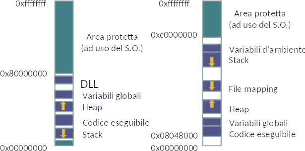

# Course summary
Brief summary of the entire course program.
Complete notes available [here](../README.md).

# Table of contents
1. [Piattaforme di esecuzione](#1-piattaforme-di-esecuzione)
2. [Il modello di esecuzione](#2-il-modello-di-esecuzione)
3. [Allocazione della memoria](#3-allocazione-della-memoria)
4. [Introduzione al C++](#4-introduzione-al-c)
5. Gestione delle eccezioni
6. [Composizione di oggetti](#6-composizione-di-oggetti)
7. [Ereditarietà e polimorfismo](#7-ereditarietà-e-polimorfismo)
8. [Funzioni e operatori](#8-funzioni-e-operatori)
9. [Programmazione generica](#9-programmazione-generica)
10. Librerie C++
11. [Librerie](#11-librerie)
12. [Programmazione concorrente](#12-programmazione-concorrente)
13. [Programmazione concorrente in C++](#13-programmazione-concorrente-in-c)
14. [Threads](#14-threads)
15. [Condition variables](#15-condition-variables)
16. [Interprocess communication on Windows](#16-interprocess-communication-on-windows)
17. [Interprocess communication on Linux](#17-interprocess-communication-on-linux)
18. [C# introduction](#18-c-introduction)
19. [WPF](#19-wpf)
20. [Multithreading in .NET e C#](#20-multithreading-in-net-e-c)

# 1. Piattaforme di esecuzione

### Interfacciarsi con il sistema operativo
- **API** (system calls)
    - Riguardano il codice sorgente
    - Completamente indipendenti dalla macchina fisica
- **ABI**: Application Binary Interface
    - Definisce che formato l'oggetto compilato deve assumere affinché sia eseguibile sulla macchina fisica

### Gestione degli errori
- Linux: `errno`
- Windows: `GetLastError()`

# 2. Il modello di esecuzione

#### Creazione di un processo
1. Creazione dello [**spazio di indizzamento**](#spazio-di-indirizzamento)
    - **File eseguibile** (ELF/PE2): code, data, stack and heap
1. Caricamento dell'eseguibile in memoria
1. Caricamento delle librerie (DLLs)
1. Avvio dell'esecuzione
    1. Inizializzazione:
        - Stack
        - Registri
        - Exception data structures
    1. Costruttori degli oggetti globali
    1. `main(int argc, char** argv)`
    1. `exit()`, che rilascia:
        - Spazio di indirizzamento
        - Tutte le risorse allocate

# 3. Allocazione della memoria

##### MMU page flags
R, W, X, [COW](https://en.wikipedia.org/wiki/Copy-on-write)

##### Tipi di variabili 
- Globali
    - Lifecycle: prima dell'esecuzione del programma
    - **Indirizzo fisso e assoluto**
- Locali
    - Lifecycle: blocco
    - **Indirizzo relativo** all'inizio dello stack
- Dinamiche (heap)
    - Lifecycle: da `malloc()` a `free()`

### Spazio di indirizzamento

- OS kernel space
- Variabili d'ambiente
- Codice eseguibile (R/X)
- Stack (R/W)
    - Variabili locali
    - Valori di ritorno
    - Parametri
- Costanti (R)
- Variabili globali (R/W)
- Heap (variabili dinamiche)

### Allocazione in Linux
- `malloc()` effettua una syscall dell'O.S., i cui dettagli dipendono dall'implementazione
- Ogni PCB (*Process Control Block*) contiene una `mm_struct` (*memory descriptor*), che contiene
    - `start_brk`/`brk`: inizio/fine heap
        - `int brk(void* end_data_segment);` sposta il puntatore di fine heap
        - `void* sbrk(intptr_t increment);` puo' incrementare lo heap
    - `start_stack`

### Allocazione in Windows (multiple heaps)
- `malloc()` usa il *global heap*
- *Local heaps* management
    - `HANDLE HeapCreate()`
    - `void* HeapAlloc(HANDLE heap, DWORD options, SIZE_T s )`
    - `BOOL HeapFree(Handle heap, DWORD options, void* ptr)`
    - `BOOL HeapDestroy(HANDLE heap)`

# 4. Introduzione al C++

### C++ compiler
- Gestisce il ciclo di vita delle variabili globali e locali

# 6. Composizione di oggetti

### La regola dei tre
Devono esistere tutte le tre seguenti funzioni, o nessuna:
- Costruttore di copia
- Operatore di assegnazione
- Distruttore

Altrimenti il compilatore fornira' la propria implementazione.

### Costruttore di copia
```cpp
class CBuffer {
    int size;
    char* ptr;
public:
    CBuffer(const CBuffer& source) {
        this->size = source.size;
        this->ptr = new char[size];
        memcpy(this->ptr, source.ptr, size); 
    }
};
```

### Operatore di assegnazione
```cpp
CBuffer& operator=(const CBuffer& source) {
    
    // Altrimenti verrebbe eliminato l'oggetto corrente, e ci sarebbero errori durante la copia.
    if (this != &source) {
        
        // Distruzione dell'oggetto corrente per evitare un memory leakage
        delete[] this->ptr;
        this->ptr = NULL; // evita dangling pointer se `new char[size]` fallisce successivamente.
                          // `delete NULL;` e' lecito.
                          // In caso in cui `new char[size]` fallisca, il compiler rilascerebbe
                          // un'altra volta la memoria se `this->prt != NULL`
                          // (perche' fa roll-back, non si e' in un blocco try...).

        // Copia di tutti i fields, come nel costruttore di copia
        this->size = source.size;
        this->ptr = new char[size]; // puo' lanciare un eccezione se non c'e' memoria
        memcpy(this->ptr, source.ptr, size); 
    }
    
    return *this; // allows '= chains'
}
```

### Costruttore di movimento
```cpp
class CBuffer {
    int size;
    char* ptr;
public:
    // Il compilatore decide quando usarlo, preferendolo a quello di copia
    CBuffer(CBuffer&& source) { // '&&' = RValue reference
        this->size = source.size;
        this->ptr = source.ptr; // vantaggio
        source.ptr = NULL; // l'originale viene modificato!
    }
};
```

### Assegnazione per movimento
```cpp
class CBuffer {
    int size;
    char* ptr;
public:
    CBuffer& operator=(CBuffer&& source) {
        if (this != &source) {
            delete[] this->ptr; // svuotamento dell'oggetto destinazione
            this->size = source.size;
            this->ptr = source.ptr;
            // source.size = 0; // inutile, `source` verra' distrutto 
            source.ptr = NULL; // la sua successiva distruzione non fara' danno
        }
        return *this;
    }
};
```

### Paradigma *Copy&Swap*
Per evitare errori dovuti alla dimenticanza di `this->prt = NULL;`
```cpp
class intArray {

    std::size_t mSize;
    int* mArray;

public:

    // Costruttore
    intArray(std::size_t size = 0): mSize(size), mArray(mSize ? new int[mSize] : NULL) {}

    // Costruttore di copia
    intArray(const intArray& that): mSize(that.mSize), mArray(mSize ? new int[mSize] : NULL) {
        std::copy(that.mArray, that.mArray + mSize, mArray);
    }

    // Distruttore
    ~intArray() { delete[] mArray; }

    // Funzione esterna ad una classe, ma che puo' accedere ai suoi `private` fields 
    friend void swap(intArray& a, intArray& b) {
        std::swap(a.mSize, b.mSize);
        std::swap(a.mArray, b.mArray);
    }

    // Operatore di assegnazione secondo il paradigma Copy&Swap
    intArray& operator=(intArray that) { // per valore, copiato o mosso a seconda
                                         // del contesto
        swap(*this, that); // usa la versione custom di questa classe
        return *this;
    }

    // Costruttore di movimento secondo il paradigma Copy&Swap
    intArray(intArray&& that): mSize(0), mArray(NULL) {
        swap(*this, that);
    }
};
```

# 7. Ereditarietà e polimorfismo

### Metodi virtuali e virtuali astratti
```cpp
    class File {
    public:
        virtual int v() { return 1; }
        virtual int va() = 0; // virtual astratto
    }
```

#### V-Table
Le classi con almeno un metodo `virtual` hanno un puntatore aggiuntivo che punta ad una **V-Table** che ha tante entry quanti sono i metodi `virtual` nella classe stessa.

- Le sue entries contengono gli indirizzi delle implementazioni concrete dei metodi polimorfici
- Costruita a compile-time
    - Statica
    - Condivisa da tutte le istanze concrete della stessa classe
- Ereditarieta'
    - Ereditarieta' semplice: una V-Table, prima le entry della super-class, poi quelle della classe stessa
    - Erediterieta' multipla: tante V-Table quante sono le super-classi piu' una per la classe stessa

### Type casting

#### `static_cast<T>`
- Done at compile time
    - Efficient
- Viene cambiata il puntatore alla V-Table
- Usato per conversioni lungo l'asse ereditario
    - Upcasting sempre garantito, il downcasting no
- Il compiler deve avere delle regole di conversione tra i tipi
    - Importatore:
    - Esportatore:

#### `dynamic_cast<T>`
- RTTI: Run-Time Type Information
    - Ogni oggetto ha un hash per il compatibility check
- Downcasting sicuro, perche' se non e' possibile ritorna:
    - `0` su puntatore invalido
    - Runtime exception su riferimento incompatibile

#### `reinterpret_cast<T>`
- Il cast del C
- Interpreta la sequenza di bit come un altro tipo
    - Nessun check
- Adatto al low level programming

#### `const_cast<T>`
- Rimuove il descrittore `const` da una variabile

# 8. Funzioni e operatori

### Puntatori a funzione
- Example
    ```cpp
    int (*var)(int, double);
    var = f;
    var = &f; // it's the same, more coherent
    ```

### Oggetti funzionali o *funtori*
- Example
    ```cpp
    class FC {
    public:
        int operator()(int v) {
            return v*2;
        }
    };

    FC fc;
    int i = fc(5);  // object behaving like a function
                    // i = 10
    ```

### Lambda functions
- Example
    ```cpp
    int main() {
        std::vector<int> v;
        // ...
        std::for_each(v.begin(), v.end(), 
            [](int i) -> void { std::cout << i << " "; }
        );
    }
    ```
- Usage
    - Algoritmi generici
    - Programmazione funzionale: programmazione in cui funzioni ritornano altre funzioni
    - Programmazione concorrente

# 9. Programmazione generica
- In C++, i templates sono **compilati** in due fasi:
    1. Coerenza ai vincoli
    2. Istanziazione dei template: generazione del codice a seconda degli utilizzi
        - I templates quindi **sono completamente risolti in fase di compilazione**
- Applicabile a **funzioni o a classi**

### Generic functions
- Example
    ```cpp
    template <class T>
    const T& max(const T& t1, const T& t2) {
        return (t1 < t2 ? t2 : t1);
    }
    ```
    - `T` deve avere `operator+()`
    - `T` deve aver un costruttore di copia, per derivare una variabile temporanea a partire da un dato costante
    - Forzare la scelta
        ```cpp
        max<double>(2, 3.14);
        ```
- Anche con valori fissati
    ```cpp
    template <class T, int size> // valore costante, non una espressione
    ```

### Specializzare un template
- Example
    ```cpp
    class Person { // incapsula una stringa
        std::string name;
    public:
        Person(std::string n): name(n) {}
        // Does not override operator+().
        // How could we use the `Accum`(ulator) template
        // with `Person`(s)?
    };

    // Template specializzato per la classe `Person`
    template<> class Accum<Person> {
        int total;
    public:
        Accum(int start = 0): total(start) {}
        int operator+(const Person&) { return ++total; }
    };
    ```

#### C++ Smart Pointers
```cpp
#include <memory>
```
- `std::shared_ptr<BaseType>`
    - Conteggio dei riferimenti
    - Copiabile e assegnabile
    - Inizializzabile 
        - `make_shared<BaseType>(params...)`
        - Copia o assegnazione
    - `NullPointerException` se inizializzato con `NULL`
    - Due campi: 64 bit, accesso due volte
        - 
        - Proprieta' condivisa `objectPtr`
        - Blocco di controllo `counterPtr`
            - `counter`, contatore dei riferimenti
            - `weakCnt`
            - `objectPtr`, per distruttore
    - Non supporta dipendenze cicliche
- `std::weak_ptr<BaseType>`
    - Senza conteggio di riferimenti = cicli
    - Si crea a partire da uno `shared_ptr`
    - Si accede al dato promuovendolo temporaneamente ad uno `shared_ptr` tramite `lock()`
        - Controllare la validita' con `expired()`
    - Puntano solo al blocco di controllo
        - Non partecipano al conteggio dei riferimenti
- `std::unique_ptr<BaseType>`
    - Non copiabile, ne' assegnabile
        - Nessuna struttura di controllo dei conteggi
    - Movibile
    - Usi
        - Garantire la distruzione di un oggetto
        - Gestione sicura di oggetti polimorfici
        - `std::make_unique<BaseType>()`

# 11. Librerie
- L'uso di una libreria richiede due fasi
    1. Identificazione dei moduli necessari e loro caricamento in memoria
    1. Aggiornamento degli indirizzi per puntare correttamente ai moduli caricati
- Librerie gestite da:
    - Linker (librerie statiche)
    - Loader (librerie collegate dinamicamente)
    - Durante l'esecuzione dal programma stesso (librerie caricate dinamicamente)
- Il loader carica dei `.dll` in modo ricorsivo


### Tassonomia delle librerie
- Librerie statiche (linker)
- Librerie dinamiche
    - Collegate dinamicamente (loader)
    - Caricate dinamicamente (dal programma stesso)

#### Librerie statiche
- Stessi contenuti in processi differenti
    - Pagine fisiche replicate
- Ogni applicazione che fa uso di una libreria statica dev'essere ricompilata ad ogni modifica della libreria
- Archivio, `lib*.a` in Linux e `.lib` in Windows
    - Concatenazione di file `.o`
    - L'*archiver* `ar` aggiunge file `.o` ad una libreria statica

#### Librerie dinamiche
- L'executable contiene info su dove recuperare le librerie
- File `.so` in Linux (ELF) e `.dll` in Windows (PE2)
- Condivisione di pagine fisiche
    - Librerie mappate in spazi di indirizzamento lontani dall'executable
- Linux dynamic linker: `ld.so`
- Come si caricano in Linux
    - `dlopen()` mappa un `.o` nello spazio di indirizzamento del programma
    - `dlsym()` cerca l'indirizzo di un simbolo (variable o funzione) di un file `.o` aperto    
- Come si caricano in Windows 
    - `LoadLibrary()` mappa un DLL nello spazio di indirizzamento del programma

# 12. Programmazione concorrente

### Thread e memoria
- I thread condividono:
    - Spazio di indirizzamento (variabili globali)
    - Codice
    - Costanti
    - Heap
- Ogni thread ha:
    - Stack delle chiamate (variabili locali)
    - Puntatore all'ultimo contesto per la gestione delle eccezioni
    - Lo stato del proprio processore virtuale

# 13. Programmazione concorrente in C++

### Esecuzione asincrona
- Funzione `std::async()`
- Funzione eseguita in un altro thread
- Restituisce `std::future<T>`
    - **E' solo movibile** (non e' copiabile)
    - `get()` per il risultato
        - Rilancia l'eccezione se il thread asincrono ne ha lanciata una
        - Si blocca in attesa se l'operazione non e' finita
        - Se l'esecuzione non e' iniziata, ne forza l'avvio
        - Chiamabile una volta sola, altrimenti eccezione
    - `wait()`
        - Consente di non consumare il risultato subito, garantendo al chiamante della `get()` di ottenere qualcosa di significativo
        - Chiamabile piu' volte
- `std::launch::async` attiva sempre un thread secondario
    - `std::async` puo' non creare un thread se ci sono poche risorse
    - Pericoloso perche' lo stack viene copiato per ogni thread
- `std::launch::deferred`
    - Lazy evaluation upon calling `get()` or `wait()`
    - Il sistema prova a creare un secondo thread, altrimenti segna l'attivita' come *deferred*
- Il metodo `shared()` su un `std::future<T>` ritorna un `std::shared_future<T>`
    - Puo' essere interrogato piu' di una volta
    - Costa di piu' in termini di memoria
    - Stessi metodi `get()`, etc.
        - Invalida il `std::future<T>` originale
    - E' anche copiabile

### `std::mutex`
- `lock()` e `unlock()`
- Altri tipi
    - `std::recursive_mutex` e' ricorsivo (`lock()` piu' volte) ma occorre chiamare `unlock()` tante volte quanto e' stato chiamato il `lock()` (si comporta quindi come un semaforo)
        - `std::timed_mutex` aggiunge i metodi `try_lock_for()` e `try_lock_until()`
        - `std::recursive_timed_mutex`
    - `std::lock_guard<Lockable>` per il paradigma RAII
        - `std::unique_lock<Lockable>` estende `lock_guard`
            - Consente di rilasciare e riacquisire l'oggetto `Lockable` tramite `unlock()` e `lock()` (in questo ordine)
            - Il costruttore ha piu' politiche di gestione
                - `adopt_lock` verifica che il thread possieda gia' il `Lockable` passato come parametro e lo adotta
                - `defer_lock` si limita a registrare il riferimento al `Lockable`, senza cercare di acquisirlo

### `std::atomic<T>`
- Accesso in modo atomico a `T`
    - Internamente implementato con uno spinlock
- Migliore del `std::mutex` per dati elementari

# 14. Threads

### Creazione di thread secondari
- `std::thread`
- Inizia subito ad eseguire
- Differenza tra `std::thread` e `std::async`
    - `std::async` puo' essere attivato in modalita' lazy, con `std::thread` no
    - `std::thread` alloca uno stack (di solito 1MB)
    - Non c'e' un meccanismo per [accedere al risultato](#restituzione-dei-risultati)
        - `std::thread` puo' [lanciare un'eccezione](#cosa-succede-quando-un-thread-fallisce)

### Restituzione dei risultati

#### Cosa succede quando un thread fallisce
1. Direttiva `CreateThread`, che ha come parametri `stackSize`
1. Lo stack viene allocato, default 1MB
1. Viene creato un *Thread Kernel Object*, cosi' che lo scheduler possa utilizzarlo
1. L'exit code del thread e' nel *Thread Kernel Object*
1. Il thread va in esecuzione
    - Successo: viene eseguita `ExitThread()`
    - Fallimento: viene eseguita `ExitProcess()`
        1. `std::terminate` in Linux
        1. Termina l'intero processo

#### Come terminare un thread
- Movimento ad un altro oggetto
- Aspettare la sua terminazione con `join()`
- `detach()` per renderlo un daemon thread

#### Retrieve results while secondary thread is still running
- Solution: `std::promise<T>`
    - One `std::promise<T>` object for each intermediate results
    - Un `std::promise<T>` ha associato un `std::future<T>`
        - Il chiamante puo' quindi chiamare la `get_future().get()`

# 15. Condition variables
- Richiede l'uso di un `std::unique_lock<Lockable>`

# 16. Interprocess communication on Windows
- I processi, al contrario dei thread, non condividono lo spazio di indirizzamento

### Processi in Windows
- `CreateProcess(...)`

### Processi in Linux
- `fork()`
    - Lo spazio di indirizzamento viene duplicato in *CopyOnWrite*

#### `fork()` e threads
- Il processo figlio ha sempre un solo thread
- I thread secondari del processo padre non si duplicano
- Gli oggetti di sincronizzazione presenti nel padre possono trovarsi in stati incongruenti
- Funzione da invocare prima di `fork()`
    ```c
    int pthread_atfork(
        void (*prepare)(void),  /* invocata prima di `fork()`: e.g., liberazione
                                   lock, o acquisizione di tutti i lock */
        void (*parent)(void),   // solo dal padre, prima che `fork()` ritorni
        void (*child)(void),    // solo dal figlio, prima che `fork()` ritorni
    );
    ```

### IPC: InterProcess Communication
- Scambio di dati
- Comunicazione di eventi
- Tipi di IPC
    - Code FIFO di messaggi
    - Pipe
    - Memoria condivisa
    - Files
    - Sockets
    - Signals (Linux only)
- Gli oggetti kernel sono identificati:
    - Tramite in numero in Linux
    - Tramite una stringa in Windows

### Sincronizzazione con oggetti kernel Windows
- Stati oggetti kernel
    - Segnalato (attivo)
        - Quando ha terminato l'esecuzione
    - Non segnalato (passivo)
- `WaitForSingleObject()`
    - Sospende il thread in case il kernel object non sia in *stato attivo*
- `WaitForMultipleObjects()`
- `Event`
    - Non esiste in Unix
    - Come le condition variable, il programma si blocca su un evento finche' non accade
    - Tipi
        - Manual-reset: rimane nello stato in cui si porta
        - Auto-reset: lo stato viene resettato quando l'evento accade
- `Semaphore`
    - Stato segnalato se contatore > 0
    - Stato non segnalato se contatore = 0
    - Non puo' mai essere < 0
- Mutex
    - Equivalente ad un semaforo inizializzato ad 1
- Occorre chiamare `close(HANDLE)` alla fine del ciclo di vita di un oggetto kernel

#### Mailslot
- Event queue for IPC
- Stesse API per la lettura dei file (ma sono bloccanti): `ReadFile(...)` e `ReadFileEx(...)`
- `GetMailslotInfo(...)` restituisce:
    - Il numero di messaggi
    - La dimensione del primo messaggio da leggere

#### Pipe
- Anonymous pipe
    - Monodirezionali
    - Come le pipe Unix
    - Tra due processi parenti
        - E.g., `|` per `stdout` dentro un `stdin`
    - Byte-oriented
    - `ReadFile(...)` e `WriteFile(...)`
    - Solo sincrone (bloccanti)
- Named pipe
    - Bidirezionali
    - Non esistono in Unix
    - Gestibili come file: `ReadFile()`, `WriteFile()`
    - Read modes: byte-oriented **and** message-oriented
    - Wait modes: bloccante o non bloccante (callback)

#### File Mapping
- Mappatura di una porzione del paging file nel proprio spazio di indirzzamento
- Occorre sincronizzazione (e.g., mutex)
- `CreateFileMapping(...)` crea un file mapping
- `MapViewOfFile(...)` lo aggiunge allo spazio di indirizzamento e restituisce l'indirizzo di partenza
- `UnmapViewOfFile(...)` e `CloseHandle(...)`

#### Altri meccanismi
- Socket
- RPC

# 17. Interprocess communication on Linux

#### Message Queues
- Equivalente del Mailslot di Windows
- I processi che intendono comunicare si accordano su:
    - Pathname di un file esistente
    - Project-ID (`0` to `255`)

#### Pipe
- Equivalente delle anonymous pipes on Windows

#### FIFO
- Equivalente delle named pipes on Windows
- Si accede come se fosse un file

#### Shared Memory
- Mappano dei blocchi di memoria negli spazi di indirizzamento
- API

# 18. C# introduction

### Achitettura .NET
- VM: CLR (*Common Language Runtime*)
    - Esegue il *managed code*: codice utilizzato per la costruzione di applicazioni .NET
    - CIL: *Common Intermediate Language*
        1. Consente al programmatore di non conoscere l'architettura della macchina sottostante, e quindi della grandezza dei tipi
        1. **I compiler su VM gestiscono tutto su stack** (_stack-based execution_) invece che nei registri (register-based execution), perche' non conoscono l'architettura fisica sottostante.
            - Operare con lo stack e' molto meno efficiente rispetto ai registri della CPU
        1. **Il JIT compiler puo' tradurre queste operazioni utilizzando i registri**

### NGEN: Native image GENeration
- Compilazione ahead of time
    - In fase di installazione su una data piattaforma

### Classi
- Come in Java: ereditarieta' singola, estende multiple interfacce
- Elementi delle classi
    - Costanti (`const int`) (Java's `final`)
    - Campi
    - Metodi
        - Implitic `this` argument
    - Proprieta': campi con getter e setter
        - Sintassi
            - Auto-generati
                ```css
                public class Test {
                    public string Caption {
                        get; set;
                    }
                }
                ```
    - Indicizzatori (`operator[]` di C++)
        - Proprieta' di nome `this`
        - Sintassi
            ```cs
            public class ListBox: Control {
                private string[] items;
                public string this[int index] {
                    get { return items[index]; }
                    set {
                        items[index] = value;
                        Repaint();
                    }
                }
            }
            ```
    - Eventi
    - Operatori
    - Costruttori
    - Distruttori
- `static` e non-`static`

### Callback e `delegate`
- Instanze di tipo `delegate` hanno una lista di subscribers (watchers)
    - `+=` per aggiungersi alla lista, `-=` per levarsi, `=` per sovrascrivere la lista
- Example
    1. Tipo `delegate`
        ```cs
        delegate void Handler(string msg);
        ```
    1. Instanziazione del tipo `delegate`
        ```cs
        /** `Handler` accetta una funzione come parametro.
         *  La funzione accetta come parametro una `string` e restituisce `void`.
         *
         *  L'invocazione di `myHandler` causa l'invocazione di `obj.someMethod`
         *  e di tutte le altre callback assegnate.
         */
        Handler myHandler = new Handler(myObj.someMethod);

        // Aggiunge una callback
        myHandler += new Handler(anotherObj.doSomething);
        myHandler += evenAnotherObject.methodName; // nuova sintassi
        ```
    1. Si invoca il delegato
        ```cs
        myHandler("Message description"); // vengono chiamate tutte le callbacks
        ```

### Eventi
- Keyword da aggiungere all'istanziazione di un tipo `delegate`
    ```cs
    event Handler myHandler;
    ```
- `+=`, `-=`, ma **non** `=`
- [Comparison chart](https://techdifferences.com/difference-between-delegates-and-events-in-c-sharp.html)
    | BASIS FOR COMPARISON | DELEGATES                                                 | EVENTS                                                              |
    |----------------------|-----------------------------------------------------------|---------------------------------------------------------------------|
    | Syntax               | `delegate return_type delegate_name(parameter_list);`       | `event event_delegate event_name;`                                    |
    | Declaration          | A delegate is declared outside any class                 | An event is declared inside a class                                |
- Esempio
    ```cs
    public delegate void Handler(object sender, EventArgs e);

    public class Button {

        public event Handler Click;

        protected void onClick() {
            var clicked = Click; // in caso di accesso multithread
            if (clicked != null) {
                clicked(this, new MouseEventArgs(/* ... */)); // solleva l'evento
            }
        }
    }

    public class Test {

        public static void MyHandler(object sender, EventArgs e) {
            // React to event...
        }

        public static void Main() {
            Button b = new Button();
            b.Click += new Handler(MyHandler);
        }
    }
    ```

# 19. WPF

### WPF threads
- Rendering thread
- UI thread

#### Dispatcher
- Scambiatore di messaggi tra threads
- Rendering thread e UI thread accedono alla coda del Dispatcher
    - **Tutti** gli oggetti WPF hanno accesso al Dispatcher perche' derivano da `DispatcherObject`
- `Invoke()`: sincrono, bloccante
- `BeginInvoke()`: asincrono, non bloccante

### `DependencyProperty`
- Informazioni grafiche
- Esempio
    ```cs
    public partial class MyWindow: Window {

        public static readonly DependencyProperty SizeProperty =
            DependencyProperty.Register("Size", 
                        typeof(double), 
                        typeof(MyWindow), 
                        new UIPropertyMetadata(3));

        public double Size {
            get { return (double) GetValue(SizeProperty); }
            set { SetValue(SizeProperty, value); }
        }

        //…
    }
    ```
- Registrarsi al cambiamento
    ```cs
    DependencyPropertyDescriptor sizeDescr = 
        DependencyPropertyDescriptor.FromProperty(
            MyWindow.SizeProperty, 
            typeof(MyWindow)
        );

    if (sizeDescr!= null) {
        sizeDescr.AddValueChanged(this, 
            delegate {
                // Add your propery changed logic here...
            }
        );
    }
    ```

# 20. Multithreading in .NET e C#

- In ogni `System.Threading.Thread` c'e' un thread nativo, ma **non** il contrario
- Tipi
    - Foreground
    - Background: l'applicazione puo' terminare prima

#### Thread exceptions
Se un thread secondario fallisce, il thread principale **non** termina.

### Sincronizzazione in .NET

####  Monitor .NET
```cs
public sealed class Monitor {

    private Monitor();

    // `obj` e' l'oggetto su cui ci si sincronizza
    // (di oggetti nello heap, altrimenti non ha senso)
    // (`this` per bloccare l'intera classe)
    public static void Enter(object obj); // in the critical zone
    public static void Exit(object obj);

    public static void Wait(object obj);
    public static void Pulse(object obj);
    public static void PulseAll(object obj);
}
```
- Equivalente di `std::mutex` di Win32
- Ha anche una condition variable
- `Enter()` puo' lanciare eccezioni
    ```cs
    try {
        Monitor.Enter(this);
        // ...
    } finally {
        Monitor.Exit(this);
    }
    ```
    - Syntactic sugar
        ```cs
        lock(object obj) { /* code */ }
        ```
